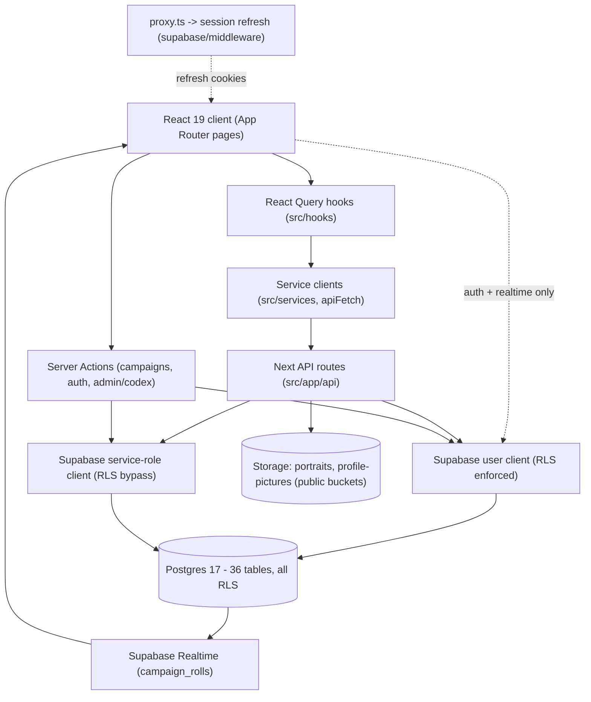

# RealmsRPG — Comprehensive Codebase Audit (June 2026)

> **Author's note.** This is a fresh, outside-perspective audit performed without reading any project documentation (`src/docs/**` and all `.md` files were deliberately excluded to avoid inheriting the team's existing framing or blind spots). Every finding below is derived directly from the live source code and the **live Supabase database** (project `RealmsRPG-Test` / `lbqhiwudvifmkjtkccdg`), inspected read-only via the Supabase MCP. The lens throughout is that of a senior React + Supabase engineer with TTRPG-platform experience: *Does this make sense? Can it be simpler? Does it already exist elsewhere? Why is it here? What does it do?*

---

## 1. Executive summary

RealmsRPG is a D&D-Beyond-style TTRPG web app: **Next.js 16 (App Router) + React 19 + Tailwind v4 + Supabase (Postgres 17, Auth, Storage) + Vercel**. It is a genuinely large, feature-rich application — character creator and sheet, six content creators (power, technique, empowered-technique, item, species, creature), a codex, a personal + official library, campaigns with live dice rolls, encounters/combat, crafting, and an admin console.

**Scale:** ~460 source files / ~86,000 lines of TS/TSX (247 `.tsx`, 213 `.ts`), 36 Postgres tables (all RLS-enabled), 8 DB functions, ~16 triggers, 2 storage buckets.

**Overall health verdict: B− / "solid bones, accreting weight."** The architecture is fundamentally sound and the team has clearly invested in unification (canonical `GridListRow`, `UnifiedSelectionModal`, `ListHeader`, shared filters, a columnar JSONB persistence pattern with DB triggers, real RLS on every table, server-side admin checks, Zod validation on most mutations, a magic-byte image validator, an open-redirect guard). This is **not** a beginner codebase.

However, it is showing the classic symptoms of fast, multi-author (and likely multi-agent) growth:

- **Duplication is the dominant problem.** The same logic is re-implemented in parallel in many places: dice-split math in 3 calculators, action-type derivation in 2, training-point caps in 2 (with different formulas), four near-identical `Official*List` components, two separate "load/add from library" data pipelines, six copy-pasted user-library fetch hooks, and four structurally identical CRUD service modules.
- **Dead code and leftover artifacts** are scattered around: empty leftover route/lib directories (`api/campaigns/[campaignId]/**`, `src/lib/firebase/`), unused components (`item-list.tsx`, `quick-armaments-sections.tsx`, `ui/collapsible.tsx`), and unused exports.
- **A handful of real security/correctness gaps** (none catastrophic): unauthenticated service-role reads, a server action that trusts a client-supplied user id, public storage buckets with no size/MIME ceiling, and inconsistent rate-limit keying.
- **Several "god files"** (1,000–2,000+ lines) concentrate data-fetching, calculation, and UI in single client modules, hurting testability, bundle size, and the ability to reason about the code.
- **Schema design carries denormalization debt**: membership tracked three ways, identity anchored two ways (`text` vs `uuid`, `user_profiles` vs `auth.users`), and promoted "columnar" columns kept in sync by triggers for some tables but not others.

**Corrections to common assumptions** (verified against disk + DB):
- There is **no active duplicate campaign route** — `api/campaigns/[campaignId]/**` exists only as an **empty directory tree** (a latent build footgun, but currently inert). The live routes all use `[id]`.
- **Firebase is fully gone** from runtime: no dependency in `package.json`, no imports in `src/`. Only an empty `src/lib/firebase/` directory and stale `.gitignore` blocks remain.

The remainder of this document gives the full architecture, the backend deep-dive, layer-by-layer frontend findings, cross-cutting themes, a prioritized issue register with stable IDs, and a recommended overhaul roadmap.

---

## 2. Architecture overview

### 2.1 Runtime data flow



The intended contract is clean: **client → React Query hook → service (`apiFetch`) → API route → Supabase user client (RLS) → Postgres.** The Supabase browser client is reserved for Auth and Realtime. This is a good architecture; the issues are in how consistently it is followed (see §5.2) and how much logic leaks into the client (see §5.6).

### 2.2 Data model (grouped)

```mermaid
flowchart LR
  subgraph identity [Identity]
    au["auth.users"]
    up["user_profiles (id text, role UserRole)"]
    un["usernames"]
    rp["role_policies"]
  end
  subgraph usercontent [User content]
    ch["characters (jsonb data + flat cols)"]
    upow["user_powers"]
    utec["user_techniques"]
    uemp["user_empowered_techniques"]
    uit["user_items"]
    ucr["user_creatures"]
    usp["user_species"]
    uei["user_enhanced_items (user_id uuid)"]
    cs["crafting_sessions (user_id uuid)"]
    enc["encounters"]
  end
  subgraph official [Official mirrors]
    opow["official_powers"]
    otec["official_techniques"]
    oemp["official_empowered_techniques"]
    oit["official_items"]
    ocr["official_creatures"]
    oei["official_enhanced_items"]
  end
  subgraph codex [Codex (read-mostly)]
    cf["codex_feats (790)"]
    csk["codex_skills"]
    csp["codex_species"]
    ctr["codex_traits"]
    cpa["codex_parts (420)"]
    cpr["codex_properties"]
    ceq["codex_equipment"]
    car["codex_archetypes + codex_archetype_levels"]
    ccf["codex_creature_feats"]
    cr["core_rules (jsonb)"]
  end
  subgraph campaigns [Campaigns]
    cmp["campaigns (characters jsonb + memberIds jsonb)"]
    cm["campaign_members"]
    croll["campaign_rolls"]
  end
  subgraph admin [Admin/ops]
    ccl["codex_change_logs"]
    ara["admin_role_audit"]
    uit2["ui_tooltips"]
  end

  au --> up
  up --> un
  up --> ch
  up --> upow
  up --> utec
  up --> uit
  up --> ucr
  up --> usp
  up --> uemp
  au --> uei
  au --> cs
  cmp --> cm
  cmp --> croll
  car --> car
```

Key structural observation: **`user_*` content tables FK to `public.user_profiles.id` (text), but `crafting_sessions` and `user_enhanced_items` FK to `auth.users.id` (uuid).** Two identity anchors and two id types coexist (see §4.2, BE-01).

---

## 3. Methodology & coverage

- **Backend:** Live introspection via Supabase MCP — `list_tables` (verbose), `pg_policies`, `pg_proc`/`pg_get_functiondef`, `information_schema.triggers`, `storage.buckets`, and the security + performance advisors. The 50 files in `sql/` were intentionally **not** treated as truth (they are a manual, partly-superseded migration log).
- **Frontend:** Layer-by-layer read of every non-doc source directory, parallelized across five thorough read-only explore sub-agents (foundations/lib, data layer, API, components, pages+hygiene), then synthesized and de-duplicated here. Sub-agent transcripts: [foundations](1704c3b4-120f-494e-b0b8-4e4d81ccaa58), [data layer](6fb3995f-9c36-41bc-83d8-3999f7703fb0), [API](03ff7b1b-51c2-4430-8096-e51803a30884), [components](921c4bf2-6a08-4bbd-8a64-be9750ce0f73), [pages & hygiene](8f155a65-6d67-492e-ba5e-88ce70bea202).
- **Cross-checks:** Disk-level verification of bracketed dynamic-route directories and empty-dir artifacts (PowerShell glob caveats noted and worked around with `-LiteralPath`/`cmd dir`).
- **Excluded:** `src/docs/**`, all `.md` files, and the generated `.next/` output.

---

## 4. Backend findings (live Supabase)

### 4.1 What's good
- **RLS is enabled on all 36 public tables**, with coherent owner-scoped policies for user content and admin-gated writes for `official_*`, `role_policies`, `ui_tooltips`, and codex change logs.
- Policies use the **`(select auth.uid())` wrapper form**, which is the Supabase-recommended pattern to avoid per-row re-evaluation of `auth.uid()` (good for performance).
- A **`prevent_unauthorized_role_change` trigger** on `user_profiles` blocks privilege escalation unless the caller is `service_role` — defense in depth beyond RLS.
- An **`rls_auto_enable` event trigger** auto-enables RLS on any new `public` table — excellent guardrail against the most common Supabase mistake.
- **`sync_library_promoted_columns`** keeps JSONB `payload` and the flattened query columns consistent for powers/techniques/items/empowered.
- **`prune_codex_change_logs_to_latest_ten`** caps audit-log growth per entity.
- Functions correctly set `search_path` and use `SECURITY DEFINER` only where needed.

### 4.2 Backend issues

**BE-01 — Two identity anchors and two `user_id` types (P1, data integrity).**
Most `user_*` tables use `user_id text` FK → `user_profiles.id` (text), but `crafting_sessions.user_id` and `user_enhanced_items.user_id` are `uuid` FK → `auth.users.id`. Their RLS compares `auth.uid() = user_id` (uuid) while everything else compares `auth.uid()::text = user_id`. This works today but is a latent join/typing hazard and forces two mental models. *Recommendation:* standardize on one identity column type and one FK target (preferably `auth.users.id` as uuid, with `user_profiles` keyed to it) in a planned migration; until then, document the split loudly.

**BE-02 — Campaign membership tracked three different ways (P1, drift risk).**
`campaigns.characters` (jsonb roster), `campaigns."memberIds"` (jsonb array), and the `campaign_members` table all encode participation. RLS on `campaign_rolls` and `characters` checks *both* `memberIds @> [...]` *and* `EXISTS (campaign_members ...)`. Three sources of truth for one fact guarantees eventual divergence and makes authz reasoning hard. *Recommendation:* make `campaign_members` the single source of truth; derive roster display from it; drop `memberIds` (and migrate the RLS/functions to use only the table).

**BE-03 — Public storage buckets make per-user SELECT policies moot; no size/MIME ceiling (P1, security/abuse).**
Both `portraits` and `profile-pictures` buckets are `public = true` with `file_size_limit = null` and `allowed_mime_types = null`. Because the buckets are public, the carefully written per-owner `SELECT` policies on `storage.objects` are effectively bypassed for reads (anyone with the URL can fetch). Avatars being world-readable may be acceptable, but the **absence of a bucket-level size and MIME limit** means the only upload guardrails are in the API routes — which can be circumvented by direct Storage uploads. *Recommendation:* set `file_size_limit` (e.g. 5 MB) and `allowed_mime_types` (image/*) on both buckets; confirm whether public read is intended; ensure INSERT policy constrains path to `{uid}/*`.

**BE-04 — `SECURITY DEFINER` campaign helpers are EXECUTE-able by `anon` (P2, security advisor).**
`auth_is_campaign_owner` and `auth_is_campaign_participant` are callable via `/rest/v1/rpc/...` by `anon`/`authenticated`. They internally gate on `auth.uid()`, so an anonymous caller only ever gets `false` — low real risk — but they are exposed surface. *Recommendation:* `REVOKE EXECUTE ... FROM anon, authenticated` (RLS policies invoke them as the table owner regardless), per the advisor remediation.

**BE-05 — Columnar promoted columns are NOT trigger-synced for several tables (P2, drift).**
`sync_library_promoted_columns` covers powers/techniques/items/empowered, but `characters` (`name`, `level`, `archetype_name`, `ancestry_name`, `status`, `visibility`), `user_creatures`, `user_species`, and `campaigns` also carry flattened columns alongside their JSONB and rely **entirely on application code** to keep them in sync (`src/lib/character-list-columns.ts`, `src/lib/character-save.ts`). Any write path that misses this will silently desync list views from the source JSON. *Recommendation:* either add equivalent triggers, or document and centralize the single write path that populates these columns.

**BE-06 — Schema naming inconsistency: quoted camelCase column (P2).**
`campaigns."memberIds"` is the lone camelCase, double-quote-required identifier in an otherwise snake_case schema (and it appears verbatim inside RLS/functions). *Recommendation:* rename to `member_ids` when BE-02 is addressed.

**BE-07 — Inactive sibling project (P2, ops).**
The org has two projects: `RealmsRPG-Test` (ACTIVE, Postgres 17, audited here) and `RealmsRPG` (INACTIVE, Postgres 15). Confirm which is production and avoid accidental drift / connection-string confusion.

**BE-08 — Performance advisors: ~17 unused indexes (P2, low).**
All current performance lints are `unused_index` (INFO), almost entirely on near-empty tables (`official_enhanced_items`, `ui_tooltips`, `admin_role_audit`, etc.). Harmless now; revisit after data grows rather than dropping prematurely.

**BE-09 — Auth: leaked-password protection disabled (P2, security advisor).**
Supabase's HaveIBeenPwned check is off. *Recommendation:* enable in Auth settings.

---

## 5. Frontend findings by layer

### 5.1 Shared foundations — `src/types`, `src/lib`
Generally well-factored (columnar mapping, feat-requirements as a single source, Supabase session helpers). Main issues:

- **DUP-01 (P1):** `computeSplits` (dice-split level) is **copied verbatim** in `src/lib/calculators/mechanic-builder.ts` (~L209), `technique-calc.ts` (~L85), and `item-calc.ts` (~L198). Export once.
- **DUP-02 (P1):** Action-type derivation duplicated between `power-calc.ts` (`computeActionType`, ~L176) and `technique-calc.ts` (~L120). Parameterize part IDs and share.
- **DUP-03 (P1):** `findByIdOrName` re-implemented locally in `proficiencies.ts` (~L91) instead of importing the canonical one from `id-constants.ts`.
- **TYPE-01 (P1):** Training-point cap diverges — `proficiencies.ts:getTrainingPointLimit` hardcodes the formula (~L30) while `game/formulas.ts:calculateTrainingPoints` (~L119) reads admin-editable `core_rules`. Sheet/creator use the hardcoded one; level-up uses the rules-aware one → admin rule edits silently don't apply everywhere.
- **TYPE-02 (P1):** `Character.skills` is typed `Record<string, number>` (`types/skills.ts:35`) but is handled as arrays at runtime with `as unknown as` casts (`use-character-sheet-actions.ts:1038`). Pick one canonical shape.
- **ARCH-01 (P1):** `types/encounter.ts` imports `Combatant` from `@/components/encounters/...` — domain types depending on the UI layer (inverted layering). Move the combatant types into `src/types`.
- **TYPE-03 (P1):** Two validation systems disagree — client `validation/schemas.ts` (name max 50 + regex) vs API `api-validation.ts` (name max 100, no regex). Share one schema.
- **DUP-04 / DEAD-01 (P2):** Duplicated combat-stat helpers across `game/formulas.ts` and `game/calculations.ts` (e.g. `unprofBonus` repeated 4×); `getArchetypeAbility` has zero callers; `buildMechanicPartPayload` and `calculateSplitDiceLevel` are exported-but-unused.
- **HYG-01 (P2):** Legacy Firebase/Firestore shapes still in types: `auth.ts` `photoURL`, `campaign-roll.ts` `{ seconds; nanoseconds }` timestamp.

### 5.2 Data layer — `src/services`, `src/hooks`, `src/stores`
Dominant pattern (React Query → service `apiFetch` → API) is good and there is **no service-role key on the client** and **no raw `.from()` outside auth/realtime** (both verified). Issues:

- **DUP-05 (P1):** Two parallel "pick from library" pipelines: `hooks/use-load-modal-library.ts` + `lib/library-selectable-builders.ts` vs `hooks/add-library-item/**`. They already diverge in which columns/chips they show. Collapse to one builder + one normalizer.
- **DUP-06 (P1):** Six near-identical `useUser*` query hooks in `use-user-library.ts` (~L193–275) despite a generic `fetchLibrary` already existing — replace with one `useUserLibrary<T>(type)` factory. Mutations were partly genericized but reads were not; species is missing `useDelete/useDuplicate` exports.
- **BUG-01 (P1):** `useMergedSpecies` (`use-user-library.ts:302`) fabricates a `UseQueryResult` (`isStale:false`, `dataUpdatedAt:0`) — broken cache semantics; consumers won't refetch correctly. Use `useQueries`.
- **PERF-01 (P1):** `findLibraryItemByName` downloads the **entire** library of a type to the client to dedupe by name on every private save (`library-service.ts:34`, called from `use-creator-save.ts:122`). Move dedupe server-side / add `?name=` lookup.
- **CACHE-01 (P1):** Query-key inconsistency — queries key on `['user-powers', userId]` but some invalidations use empty-string user ids (`user?.uid || ''`). Centralize key builders.
- **DUP-07 (P2):** Four structurally identical CRUD services (`character`/`encounter`/`crafting`/`enhanced-items`). Optional `createResourceClient<T>(basePath)` factory. `duplicateCharacter` does a wasteful full-fetch before POST.
- **DEAD-02 (P2):** `hooks/add-library-item/build-selectable-items.ts` (no importers), unused `gameDataKeys`, and `services/index.ts` only re-exports 2 of 8 services.
- **SEC-note (P2):** `useAdmin` is **UX-only** — fine, since API routes enforce role server-side; do not let it become a security boundary.

### 5.3 API layer — `src/app/api`, server actions
Auth-aware and Zod-validated on most mutations. Notable gaps:

- **SEC-01 (P1):** Unauthenticated **service-role** reads on `api/codex/route.ts` (~L408) and `api/official/[type]` GET (~L104) fully bypass RLS. Use an anon/user client with public-SELECT RLS instead; reserve service role for admin writes.
- **SEC-02 (P1):** `createUserProfileAction` (`(auth)/actions.ts:40`) accepts a client-supplied `uid` and never binds it to the session (`requireAuth()` / `uid === session.uid`). Relies entirely on RLS. Bind to session.
- **SEC-03 (P1):** `updateUserProfileAction` (`(auth)/actions.ts:107`) writes `username`/`username_display` without `validateUsername`, bypassing the reserved/blocked-name rules enforced elsewhere.
- **SEC-04 (P1):** Over-permissive write schemas — `publicItemSchema` (`api-validation.ts:347`) and the user-library create schema use a catchall blob that flows arbitrary keys into `bodyToColumnar`; `official/enhanced-items` PATCH writes **raw JSON** (`route.ts:174`). Tighten per-type or filter through column allowlists (as `admin/codex/actions.ts` already does).
- **SEC-05 (P2):** Rate-limit keying is inconsistent — most mutations key by raw IP rather than `buildRateLimitKey(prefix, {userId, ip})`; `campaign rolls POST` and several admin routes have **no** limiter; invite lookup keys by IP only. Also the limiter is in-memory per serverless instance (effective limit × instances).
- **SEC-06 (P2):** `joinCampaignAction` trusts client roster metadata (name/level/portrait/species) instead of deriving from the DB character row (spoofable roster display).
- **CONS-01 (P2):** Inconsistent response shapes/status codes (`{ok:true}` vs `{success:true}` vs `204`; `null` vs `{error}` for 404). Duplicated `rowToCampaign` + invite-code redaction across two routes. Consider a shared `api-handler` helper.
- **SEC-07 (P2):** `checkUsernameAvailableAction` is an unauthenticated, un-rate-limited username-existence oracle.
- **Positive:** Upload routes validate size + magic bytes + ownership and are rate-limited; the open-redirect guard and admin `requireAdmin()` checks are correct.

### 5.4 Components — `src/components` (181 files)
The unification baseline is real and good (`GridListRow`, `ListHeader`, `UnifiedSelectionModal`, `entity-library-sections`, `ValueStepper`, `SkillsAllocationPage`, shared filters; mobile side-scroll on the sheet body; 44px targets on `ValueStepper`). The problems are parallel copies and a11y gaps:

- **DUP-08 (P1):** `creator/LoadFromLibraryModal.tsx` re-implements `UnifiedSelectionModal` (search/sort/header/row/footer). Six creators depend on the divergent copy. Make it a thin wrapper.
- **DUP-09 (P1):** Four near-identical `shared/official-{power,technique,item,creature}-list.tsx` — collapse into one `OfficialEntityList<T>` driven by column config.
- **DUP-10 (P1):** Feat detail/chip building triplicated across `add-feat-modal.tsx` (~L32), `steps/feats-step.tsx` (~L444), and `library-feat-rows.tsx`. Extract `buildFeatDetailSections`.
- **A11Y-01 (P1):** Missing dialog accessible names — `UnifiedSelectionModal` (title only an `h2`, not wired via `titleA11y`, `unified-selection-modal.tsx:277`), `delete-confirm-modal.tsx`, `login-prompt-modal.tsx`.
- **A11Y-02 (P1):** Unlabeled controls — `character-sheet-settings-modal.tsx` Selects (~L114, L136), `CombatantCard.tsx` icon-only remove button + custom-condition input (~L541, L582), `theme-toggle.tsx` icon buttons use `title` not `aria-label` (~L47), `notes-tab.tsx` Textarea (~L133).
- **BIG-01 (P1):** Oversized files needing decomposition: `use-character-sheet-actions.ts` (~1,460; also mis-located in `components/`), `creature-stat-block.tsx` (~1,127), `grid-list-row.tsx` (~925), plus many 500–950-line step/sheet files.
- **DEAD-03 (P2):** Unused components — `shared/item-list.tsx` (459 lines, no importers), `shared/quick-armaments-sections.tsx` (401), `ui/collapsible.tsx` (167). Three different collapsible implementations exist.
- **MOBILE-01 (P2):** `onboarding-tour.tsx` modal missing `fullScreenOnMobile`; character-sheet library sub-tabs are dense (no horizontal panel scroll/collapse) at ~360px.
- **A11Y-03 / TOKEN-01 (P2):** Status text using `-600` tokens in light mode (should be `-700`) in several files; raw `bg-blue-*`/`bg-red-*`/`bg-amber-*` palette instead of semantic tokens in `CombatantCard` and creator steps.

### 5.5 Pages / routing — `src/app/(auth)`, `(main)`, `auth`
- **DEAD-04 (P2):** Legacy client-redirect routes still shipped as page modules: `encounter-tracker` → `encounters`, `crafting/new` → `crafting`, `browse` → `library` (also redirected in `next.config.ts`). Convert to config redirects and delete; fix stale `/encounter-tracker` links in `about/page.tsx` (L58/79/182/207).
- **AUTH-01 (P1):** Inconsistent route protection — admin is correctly server-gated in `admin/layout.tsx`, but only **3** pages use the client `ProtectedRoute`; most "private" pages are open client bundles relying on API 401s. Centralize hard gates (server `(main)` auth layout or `proxy.ts` matcher) and keep guest-soft routes explicit.
- **BIG-02 (P1):** Creator/sheet **route files** are enormous, fully `'use client'`, mixing data + calc + UI: `crafting/[id]` (~2,036), `creature-creator` (~1,979), `item-creator` (~1,615), `power-creator` (~1,418), `empowered-technique-creator` (~1,398), `species-creator` (~1,132), `admin/core-rules` (~978), `my-account` (~770), `characters/[id]` (~609). Split into a server shell + client islands; extract a shared `CreatorPageShell`.
- **DUP-11 (P2):** The six creator pages duplicate load/save/auth scaffolding (`useCreatorSave`, `CreatorLayout`, `CreatorSaveToolbar`, `LoadFromLibraryModal`, `SourceFilter`, `LoginPromptModal`, `Suspense`+`useSearchParams`). Extract the shell.

### 5.6 Repo hygiene & config
- **DEAD-05 (P2):** Empty leftover directories: `src/app/api/campaigns/[campaignId]/**` (no `route.ts` anywhere under it — a sibling-slug build footgun if a route were ever added) and `src/lib/firebase/` (empty). Delete both.
- **HYG-02 (P2):** Stale Firebase blocks remain in `.gitignore` though no Firebase dependency or import exists. Remove.
- **HYG-03 (P2):** Reference-data dirs `data/core-rules/*.json` (14) and `codex_csv/*.csv` (8) are committed and **not** gitignored (unlike `backups/`). Decide whether they belong in VCS or should be Supabase-only seed sources.
- **HYG-04 (P2):** `eslint-config-next@16.1.1` lags `next@16.1.6`; `prettier` is installed with no `format` script; build uses `next build --webpack` (opting out of Turbopack). `.next/` and `.vercel/` are correctly gitignored/untracked. No `ignoreBuildErrors`/`eslint.ignoreDuringBuilds` smells — good.

---

## 6. Cross-cutting themes

| Theme | Severity | Summary |
|---|---|---|
| **Duplication / re-implementation** | P1 | The #1 issue. Calculators (DUP-01/02/03), library pipelines (DUP-05/06), official lists (DUP-09), feat chips (DUP-10), CRUD services (DUP-07), load modal (DUP-08), creator pages (DUP-11). |
| **Dead code & artifacts** | P2 | Empty `[campaignId]`/`firebase` dirs, unused components (DEAD-03), unused exports (DEAD-02/DUP-04), legacy redirect pages (DEAD-04), stale gitignore (HYG-02). |
| **Security** | P1 | Service-role public reads (SEC-01), profile-action identity binding (SEC-02), username bypass (SEC-03), permissive write schemas (SEC-04), public buckets w/o limits (BE-03). All fixable; none are active data leaks today. |
| **Type safety** | P1 | Skills record-vs-array (TYPE-02), TP cap divergence (TYPE-01), client/API schema mismatch (TYPE-03), inverted layering (ARCH-01), loose `fetchCodex: any[]`, legacy Firebase shapes. |
| **Schema design** | P1 | Dual identity anchors/types (BE-01), triple membership tracking (BE-02), partial columnar sync (BE-05). |
| **Accessibility** | P1 | Missing dialog names (A11Y-01), unlabeled controls (A11Y-02), low-contrast `-600` status text (A11Y-03). |
| **Mobile** | P2 | Onboarding modal + dense sheet sub-tabs (MOBILE-01). Baseline is otherwise good. |
| **Oversized files** | P1 | ~20 files >500 lines; several route/hook files 1,000–2,000+. Concentrates risk and bundle weight. |

---

## 7. Prioritized issue register

No P0 (actively-exploited / data-loss) issues were found. IDs are stable references for tracking.

### P1 — fix in the first overhaul wave
| ID | Area | Issue | Primary location |
|---|---|---|---|
| BE-01 | DB | Dual identity anchors + `text`/`uuid` `user_id` split | `crafting_sessions`, `user_enhanced_items` vs others |
| BE-02 | DB | Campaign membership tracked 3 ways | `campaigns.characters` / `memberIds` / `campaign_members` |
| BE-03 | DB/Storage | Public buckets, no size/MIME limit; SELECT policies moot | `storage.buckets` portraits, profile-pictures |
| SEC-01 | API | Unauthenticated service-role reads bypass RLS | `api/codex/route.ts:408`, `api/official/[type]:104` |
| SEC-02 | API | Server action trusts client `uid` (no session bind) | `(auth)/actions.ts:40` |
| SEC-03 | API | Username write bypasses validation | `(auth)/actions.ts:107` |
| SEC-04 | API | Over-permissive write schemas / raw-JSON PATCH | `api-validation.ts:347`, `official/enhanced-items:174` |
| DUP-01 | lib | `computeSplits` copied 3× | `calculators/{mechanic-builder,technique-calc,item-calc}.ts` |
| DUP-02 | lib | Action-type logic duplicated | `power-calc.ts:176`, `technique-calc.ts:120` |
| DUP-05 | hooks | Two library "pick" pipelines | `use-load-modal-library.ts` vs `add-library-item/**` |
| DUP-06 | hooks | 6 copy-paste user-library hooks | `use-user-library.ts:193` |
| DUP-08 | UI | `LoadFromLibraryModal` re-implements `UnifiedSelectionModal` | `creator/LoadFromLibraryModal.tsx` |
| DUP-09 | UI | 4 near-identical `Official*List` | `shared/official-*-list.tsx` |
| DUP-10 | UI | Feat chip builder triplicated | `add-feat-modal`, `feats-step`, `library-feat-rows` |
| TYPE-01 | lib | TP-cap formula divergence (rules ignored) | `proficiencies.ts:30` vs `formulas.ts:119` |
| TYPE-02 | types | `Character.skills` record vs array | `types/skills.ts:35` |
| TYPE-03 | lib | Client vs API validation mismatch | `validation/schemas.ts` vs `api-validation.ts` |
| ARCH-01 | types | Domain type imports UI layer | `types/encounter.ts:8` |
| BUG-01 | hooks | Fake `UseQueryResult` in `useMergedSpecies` | `use-user-library.ts:302` |
| PERF-01 | hooks | Full-library download to dedupe on save | `library-service.ts:34` |
| CACHE-01 | hooks | Query-key/invalidation inconsistency | `use-user-library.ts`, `use-creator-save.ts` |
| AUTH-01 | routing | Inconsistent route protection | `(main)/layout.tsx`, `protected-route.tsx` |
| A11Y-01 | UI | Modals without accessible name | `unified-selection-modal:277`, delete/login modals |
| A11Y-02 | UI | Unlabeled selects/inputs/icon buttons | settings modal, `CombatantCard`, `theme-toggle`, notes |
| BIG-01/02 | UI/routing | God files (1k–2k lines) | sheet actions hook, creator route pages |

### P2 — second wave / cleanup
BE-04 (revoke anon EXECUTE), BE-05 (columnar sync gaps), BE-06 (`memberIds` naming), BE-07 (inactive project), BE-08 (unused indexes), BE-09 (leaked-password protection), SEC-05 (rate-limit keying), SEC-06 (roster spoofing), SEC-07 (username oracle), CONS-01 (response shapes), DUP-04/07/11 (helper/service/creator-page dedupe), DEAD-01..05 (dead code + empty dirs + redirect pages), HYG-01..04 (gitignore, committed data, tooling), TOKEN-01/A11Y-03 (tokens/contrast), MOBILE-01.

---

## 8. Recommended overhaul roadmap

**Wave 0 — Trivial, zero-risk cleanup (hours).**
Delete empty `api/campaigns/[campaignId]/**` and `src/lib/firebase/`; remove Firebase `.gitignore` blocks; delete dead components (`item-list`, `quick-armaments-sections`, unused `ui/collapsible`) and dead exports after grep-confirmation; convert `encounter-tracker`/`crafting/new`/`browse` to config redirects and fix About links; align `eslint-config-next`; enable leaked-password protection (BE-09) and revoke anon EXECUTE on the two RPCs (BE-04). *(DEAD-01..05, HYG-01/02/04, BE-04/09)*

**Wave 1 — Security & correctness (days).**
Bind `createUserProfileAction` to the session and route username writes through `validateUsername` (SEC-02/03); replace service-role public GETs with RLS-backed anon reads (SEC-01); tighten write schemas / add column allowlists (SEC-04); set bucket size/MIME limits and confirm public-read intent (BE-03); standardize rate-limit keys and add limiters to rolls/admin/invite (SEC-05); derive campaign roster from DB rows (SEC-06). *(All Wave-1 items are independent and shippable individually.)*

**Wave 2 — De-duplication (the highest long-term ROI).**
Consolidate calculators (DUP-01/02/03, DUP-04); unify the two library pipelines into one builder+normalizer and a `useUserLibrary<T>` factory (DUP-05/06, BUG-01, CACHE-01); collapse the four `Official*List` into `OfficialEntityList<T>` (DUP-09); make `LoadFromLibraryModal` a thin `UnifiedSelectionModal` wrapper (DUP-08); extract `buildFeatDetailSections` (DUP-10); add a `CreatorPageShell` (DUP-11) and a `createResourceClient<T>` (DUP-07). Fix `findLibraryItemByName` to dedupe server-side (PERF-01).

**Wave 3 — Type & schema integrity.**
Resolve `Character.skills` shape (TYPE-02); make TP cap rules-aware everywhere (TYPE-01); share one validation schema (TYPE-03); move combatant types into `src/types` (ARCH-01). Plan the DB migration to unify identity type/anchor (BE-01) and collapse membership to `campaign_members` (BE-02, BE-06); add or document columnar sync (BE-05).

**Wave 4 — Structural decomposition & a11y.**
Split god files into server shells + client islands and relocate `use-character-sheet-actions.ts` to `src/hooks` (BIG-01/02); centralize route protection (AUTH-01); fix modal accessible names and unlabeled controls (A11Y-01/02); batch-migrate `-600`→`-700` status tokens and raw palette → semantic tokens (A11Y-03/TOKEN-01); address mobile density (MOBILE-01).

Each wave is independently shippable and ordered by risk/ROI: clean the floor, lock the doors, stop the copy-paste, fix the foundations, then renovate.

---

## 9. Coverage appendix

**Backend (live DB):** all 36 `public` tables (verbose columns/PK/FK), all RLS policies (public + storage), all 8 `public` functions (full definitions), all triggers, both storage buckets, security + performance advisors, project list. Source of truth = live database, not `sql/`.

**Frontend — directories fully enumerated and reviewed:**
- `src/types/**` (17 files) — reviewed.
- `src/lib/**` (`calculators`, `game`, `validation`, `tooltips`, `supabase`, `utils`, `constants`, `codex`, `library`, `encounter`, top-level) — reviewed; `src/lib/firebase/` confirmed empty.
- `src/services/**` (8), `src/hooks/**` incl. `add-library-item/**` (37), `src/stores/**` (3) — reviewed.
- `src/app/api/**` (27 route files) + server actions (`campaigns/actions.ts`, `(auth)/actions.ts`, `(auth)/auth-actions.ts`, `admin/codex/actions.ts`) + `src/proxy.ts` — reviewed.
- `src/components/**` (181 files across `ui`, `shared`(+`filters`), `character-sheet`(+`add-library-item`), `character-creator`(+`steps`), `character`, `creator`, `codex`(+`filters`), `crafting`, `encounters`, `layout`, `providers`, `auth`) — enumerated; depth-read on largest/most-duplicated.
- `src/app/(auth)/**`, `src/app/(main)/**` (every route + co-located components), `src/app/auth/**`, root `src/app/*` — reviewed.
- Config & root: `package.json`, `next.config.ts`, `tsconfig.json`, `eslint`, `postcss`, `globals.css`, `.gitignore`, `proxy.ts`, and root dirs `backups/`, `data/`, `codex_csv/`, `reports/`, `scripts/`, `sql/` — reviewed/enumerated.

**Excluded by design:** `src/docs/**`, all `.md` files, generated `.next/` output.

**Known measurement caveats:** Line counts are approximate (±a few %). PowerShell globbing mis-handles `[bracketed]` route paths; bracketed-dir facts in this report were re-verified with `-LiteralPath` / `cmd dir`. The in-memory rate limiter's effective limit scales with serverless instance count and cannot be measured statically.
