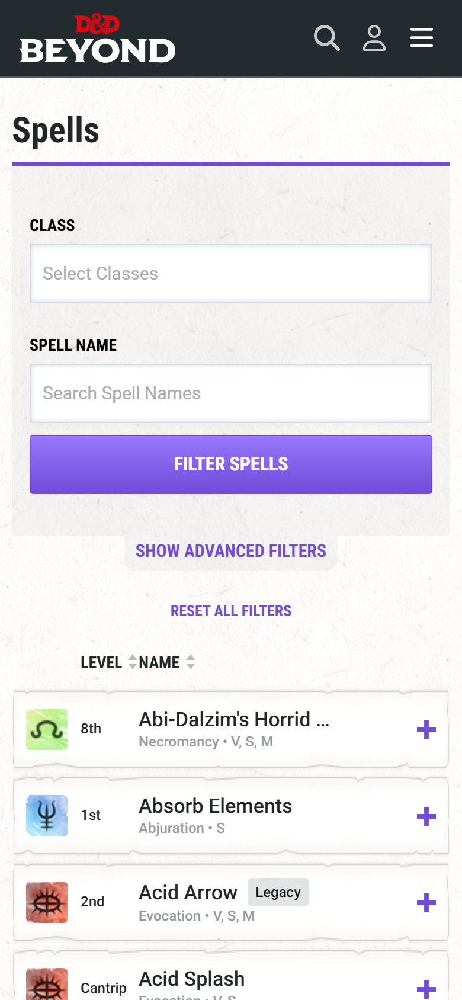
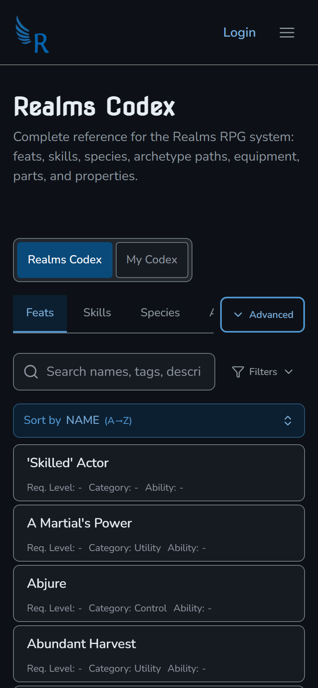
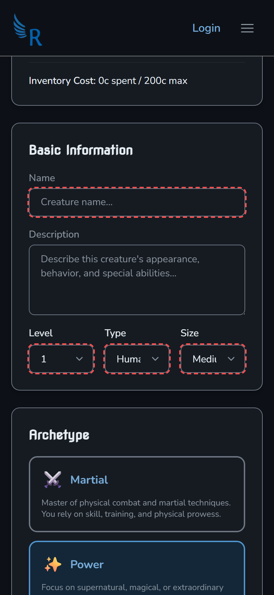
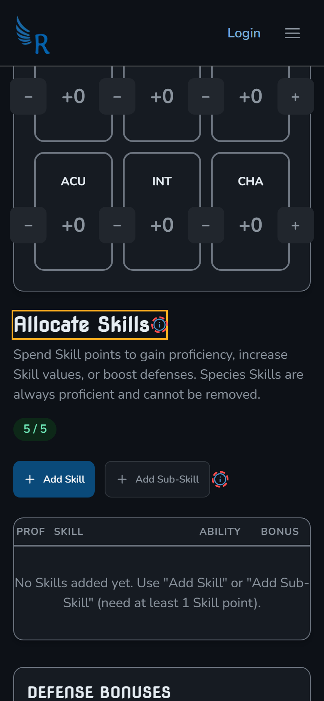
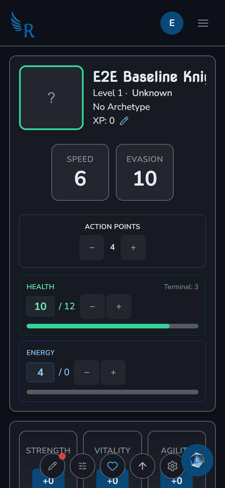
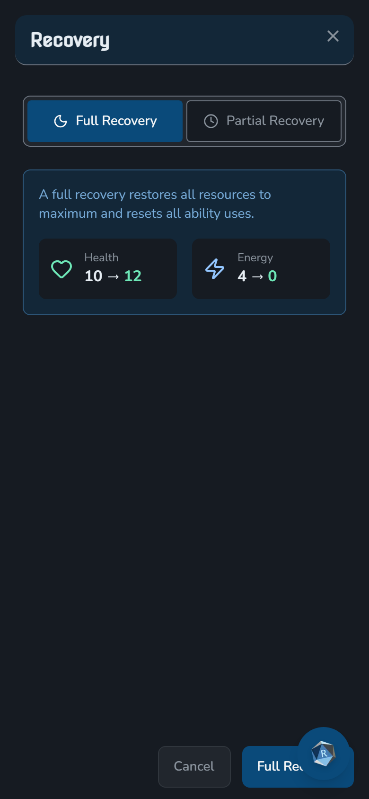

# Mobile UX Audit — 2026-08-18

Full-site mobile audit at phone widths, with a measured density comparison against D&D Beyond.

| | |
|---|---|
| **Commit audited** | `3efe80c9` (last commit on `master`) — see [Why not the working tree](#why-not-the-working-tree) |
| **Emulation** | Chromium, iPhone 13 profile: `isMobile`, `hasTouch`, DPR 2, `pointer: coarse`, `hover: none` |
| **Widths** | 390px (iPhone 13/14/15) and 360px (small-Android floor) |
| **Routes** | 24 guest routes + 14 authenticated routes/states, × 2 widths = **76 captures** |
| **Artifacts** | `shots/` viewport + full-page PNGs · `slices/` readable scroll slices with offenders outlined · `findings.json` + `findings-auth.json` raw probe data · `compare/` D&D Beyond reference |
| **Tooling** | `scripts/mobile-audit.mjs`, `scripts/mobile-audit-auth.mjs`, `scripts/mobile-slices.mjs`, `scripts/mobile-compare.mjs` |

**Coarse pointer matters.** `Button`, `IconButton`, and `ValueStepper` apply their 44px minimum behind `@media (pointer: coarse)`. A desktop browser narrowed to 390px does **not** reproduce what a phone shows. Every measurement here was taken with touch emulation on.

---

## 1. Headline: the size scale is flat, and that is why it looks bulky

The single biggest difference from D&D Beyond is not spacing, colour, or information density — it is that **we round almost every control up to 44px, and they don't.**

Measured at 390px on the same emulated device:

| Metric | DDB Spells | DDB Monsters | Realms Codex | Realms Library |
|---|---|---|---|---|
| Median control height | **36px** | **35px** | **44px** | **44px** |
| Controls under 44px | 88 / 137 (64%) | 99 / 147 (67%) | **2 / 42 (5%)** | **2 / 121 (2%)** |
| Controls 44–52px | 40 (29%) | 39 (27%) | 40 (95%) | 73 (60%) |
| Median list-row height | 73px | 73px | 68px | 84px |
| Chrome before first row | 579px | 618px | 546px | 590px |

Two things follow from this table, and one of them contradicts a natural assumption:

**The size scale is the problem.** D&D Beyond uses a graduated scale — inline text links and sort carets around 20–30px, secondary pills and filter toggles around 32–40px, and a 44px+ target reserved for the one primary action per screen (`FILTER SPELLS`) and for whole list rows. We flatten 95% of Codex controls into a single 44–52px band, so nothing reads as primary, nothing recedes, and the page looks like a stack of equally heavy slabs.

**Header bloat is *not* the differentiator.** I expected our pages to bury content under chrome, and measured it: we actually reach the first list row *sooner* than D&D Beyond does (546px vs 579px). Our headers are fine. Don't spend effort there.

The visual comparison, same device, same width:

| D&D Beyond `/spells` | Realms `/codex` |
|---|---|
|  |  |

On the left, one purple primary button and everything else is quiet. On the right, the source toggle, five tabs, an Advanced button, a search field, a Filters toggle and a Sort bar are all rendered at the same weight.

### Root cause

`Button` and `IconButton` apply an unconditional square minimum on every touch device, for every variant and every size:

```21:24:src/components/ui/button.tsx
const buttonVariants = cva(
  // Touch devices get a 44px minimum tap target (WCAG/MOBILE_UX). Scoped to
  // coarse pointers so desktop dense layouts keep their compact sizing (TASK-332).
  'inline-flex items-center justify-center gap-2 whitespace-nowrap rounded-lg text-sm font-semibold transition-all duration-base ease-standard focus-visible:outline-none focus-visible:ring-2 focus-visible:ring-offset-2 disabled:pointer-events-none disabled:opacity-50 [&_svg]:pointer-events-none [&_svg]:size-4 [&_svg]:shrink-0 [@media(pointer:coarse)]:min-h-[44px] [@media(pointer:coarse)]:min-w-[44px]',
```

`min-w-[44px]` applies to `variant="link"` and `size="sm"` too, so text links in dense chrome get inflated into buttons. The footer nav is the clearest example: twelve links each rendered at 167×44px around 39–117px of actual text.

**This is a deliberate rule, not an accident.** `MOBILE_UX.md` § Touch targets mandates 44px below `md`, and notes it is our choice rather than a WCAG AA requirement ("WCAG 2.1 AA has no 44px target requirement; 44px is our mobile UX choice"). The measurement above says the reference product we're chasing does not follow it, and the owner's read is that ours looks worse for it. **Changing this is a policy decision, not a bug fix** — see [Recommendation](#recommendation-tiered-touch-policy).

### The same rule is applied three inconsistent ways

Worse than the rule itself is that three different mechanisms implement it, so the result is uneven:

| Mechanism | Used by | Triggers on |
|---|---|---|
| `@media (pointer: coarse)` | `Button`, `IconButton`, `ValueStepper` | Any touch device, **any width** |
| `md:min-h-0` (viewport width) | `.tab-nav-trigger`, `.tab-pill-trigger`, `.touch-target-md-compact` | Below 768px, **regardless of pointer** |
| Nothing at all | `Input`, `Select`, `Textarea` | Never — fixed `h-10` = **40px** |

So on a phone, every button is ≥44px while every text field and dropdown next to it is 40px. That 4px mismatch is visible on every form in the app, and it is the mechanical reason the creators look untidy:



*Red dashed outline = control under 44px. The Name field, and the Level / Type / Size selects, are all 40px, sitting in a page where every button is 44px. The Type and Size selects also truncate their values to "Huma" and "Medi".*

---

## 2. Real bugs (visible breakage, fix regardless of the policy decision)

These are defects, independent of the size-scale discussion.

### 2.1 Creature Creator scrolls horizontally at 390px and 360px — P0

The only page in the audit with horizontal page scroll. The floating roll-log panel is pinned 20px from the right edge at a hardcoded 360px width, overhanging the viewport by 99px.

```197:209:src/components/rolls/roll-log.tsx
  return (
    <div
      className={cn('fixed right-5 bottom-5 z-floating flex flex-col items-end', className)}
      data-tour-id="sheet-tour-roll-log"
    >
      {/* Panel */}
      <Card
        className={cn(
          'absolute right-0 bottom-[70px] w-[360px] max-w-[calc(100vw-40px)]',
```

`max-w-[calc(100vw-40px)]` should contain it, but the `w-[360px]` on an `absolute` child inside a `fixed right-5` wrapper still contributes to document scroll width. No `sm:`/`md:` overrides exist. Affects every page that mounts `RollLog`, so the character sheet is very likely affected too (not verifiable while logged out — see [Coverage gaps](#coverage-gaps)).

### 2.2 Codex "Advanced" button covers the last tab — P0

`Advanced` is `flex-shrink-0` in the same flex row as the scrollable tab strip, permanently eating ~110px. The "Archetypes" tab renders underneath it.

```117:132:src/app/(main)/codex/page.tsx
        <div className="flex min-w-0 items-center gap-2">
          <div className="min-w-0 flex-1">
            <TabNavigation
              tabs={tabs}
```

A `labelMobile` is defined for these tabs but never passed through to `TabNavigation`, so full labels are used at all widths. Visible in the Codex screenshot above: the `A` of Archetypes is clipped by the Advanced button.

### 2.3 Creature Creator ability steppers spill out of their tiles — P0



The Creature Creator passes `compact={true}`, which forces `grid-cols-3` below `md` (~100px per cell), while each cell must fit a 44px `−`, a `min-w-[3rem]` value, and a 44px `+` — about 152px. The steppers escape their tiles and collide with the next column.

```170:175:src/components/creator/ability-score-editor.tsx
        <div
          className={cn(
            'grid gap-3',
            compact ? 'grid-cols-3 md:grid-cols-6' : 'grid-cols-2 sm:grid-cols-3 lg:grid-cols-6',
          )}
        >
```

Note the interaction with §1: this is *caused* by the 44px minimum. `ValueStepper` collapses to `md:w-8` on desktop but stays `w-11` on phones, which is exactly where the space isn't.

The same slice shows "Allocate Skills ⓘ" (orange outline) overflowing its inline box, and the ⓘ beside "Add Sub-Skill" detached from the button.

### 2.4 Guided creator Continue button floats over the content — P1

```74:84:src/components/guided-creator/guided-step-footer.tsx
    <div
      data-testid="guided-step-footer"
      className={cn('pointer-events-none fixed inset-x-0 bottom-0 z-30', className)}
    >
      <div
        className={cn(
          'pointer-events-auto border-t border-border-light dark:border-border',
          'bg-surface/95 shadow-raised backdrop-blur-md',
        )}
      >
```

The bar is `bg-surface/95` with `backdrop-blur-md`, so card content reads through it, and the button appears to hover over a choice card rather than sit in a footer. Visible in `shots/creator-guided@390.png`.

### 2.5 Text truncation without ellipsis — P1

Several controls clip text mid-word instead of truncating cleanly. `Select` values show "Huma" / "Medi" (§1 image); the Codex search placeholder renders "Search names, tags, descri". D&D Beyond truncates with an ellipsis ("Abi-Dalzim's Horrid …"), which reads as intentional. Ours reads as broken.

### 2.7 The character sheet is the worst surface in the app — P0

Added in the authenticated pass. Measured at 390px: **38 overlapping interactive pairs**, rising to **51 with the Recovery modal open**, and 33 sub-44px controls. Every other route in the audit is in single digits.

Two bottom-anchored `fixed` elements are positioned independently and collide with each other and with the page:

```58:58:src/components/character-sheet/sheet-action-toolbar.tsx
      className="fixed right-4 bottom-4 left-4 z-overlay flex flex-row justify-center gap-2 md:top-24 md:right-4 md:bottom-auto md:left-auto md:flex-col md:justify-start md:gap-2"
```

Below `md` that is a full-width row of five 44px circular buttons with **no backdrop and no reserved page padding**, so it floats on top of whatever sits at the bottom of the viewport. On load it covers the Strength / Vitality / Agility tiles:



`RollLog` is `fixed right-5 bottom-5` — the same corner — so its 56px FAB lands on the toolbar's rightmost button, and on modal footers. In the Recovery modal it covers the primary **Full Recovery** confirm button:



Neither component knows about the other; each hardcodes its own `bottom-4` / `bottom-5`.

### 2.8 Sheet header name and tile labels clip mid-word — P1

The sheet `h1` carries `truncate` but still overflows (196px box, 229px content) and renders "E2E Baseline Knig" with no visible ellipsis — `truncate` doesn't work when an ancestor flex item lacks `min-w-0`. In the ability and defense grids, "INTELLIGENCE" and "DISCERNMENT" touch or cross their tile edges while "MENTAL FORT." is pre-abbreviated and wraps to two lines, so tiles in one row have different heights and two different labelling conventions.

### 2.9 24 skill proficiency dots at 16×16 — P1

`SkillRow` renders the proficiency toggle as `inline-block h-4 w-4 rounded-full`. The sheet stacks 24 of them in a narrow column — the largest cluster of sub-minimum targets in the app. `.hit-area-layout-neutral` already solves exactly this problem elsewhere (16px layout box, 44px `::after`) and should be reused rather than growing the painted dot.

### 2.6 About page carousel arrow parked off-screen — P2

The "Previous section" control sits 431px left of the viewport, and the carousel dot buttons are 31–42px. Low impact, but it is dead chrome on a marketing page.

---

## 3. Not bugs (checked and dismissed)

Recording these so they don't get re-reported:

- **Inline prose links under 44px** (About page: "Character Sheets", "Powers", …, 19–22px tall). WCAG 2.5.5 explicitly exempts links inline in a sentence, and D&D Beyond does the same. Leave them.
- **`InfoTippy` 16×16 triggers.** The layout box is 16px but `.hit-area-layout-neutral::after` uses `inset: -14px` below `md`, giving a real 44×44 hit area. The measurement is a false positive — *however*, that overlay has no `pointer-events: none` and takes `z-index: 1` on hover, so in dense rows it can swallow taps meant for a neighbouring control. Worth a look, not a defect.
- **Overlapping `absolute inset-0` row buttons.** This is the intentional GridListRow expand-target pattern from `MOBILE_UX.md`, not an overlap bug.
- **Decorative blurred background blobs** overhanging the viewport. Clipped by an ancestor; they don't cause page scroll.
- **Header chrome height.** Measured better than D&D Beyond (§1).

---

## 4. Recommendation: tiered touch policy

Rather than a blanket 44px, adopt three tiers — which is what the reference product does:

| Tier | Minimum on touch | Applies to |
|---|---|---|
| **Primary** | 48px | The one main action per screen or modal footer (Save, Continue, Add Selected, Create) |
| **Standard** | 44px | Standalone buttons, list rows, tab triggers, form fields *(raise `Input`/`Select`/`Textarea` from 40 → 44)* |
| **Dense** | 32–36px + 8px spacing | `size="sm"` buttons, `variant="link"`, inline chips, steppers inside a constrained grid cell, sort carets, footer nav links |

Two concrete changes carry most of the benefit:

1. **Drop `min-w-[44px]` from `Button`** (keep `min-h`). Width is what inflates text links and footer nav into slabs; height is what actually makes a target tappable in a vertical list.
2. **Make `Input` / `Select` / `Textarea` match whatever the button height is** on touch. The 40px/44px mismatch is the most visible untidiness in every creator.

**Accepted 2026-08-18** as ADR-0023. `MOBILE_UX.md` is now six layout contracts + these three tiers; pointer drives hit area, viewport drives layout. Implementation of Button/IconButton/ValueStepper is TASK-841; form-field height is TASK-830. The multi-width ratchet is `npm run verify:responsive`.

---

## Authenticated pass — how the surfaces rank

Run as the E2E baseline user (`scripts/mobile-audit-auth.mjs`, `findings-auth.json`). Overlapping interactive pairs at 390px:

| Surface | Overlaps | Sub-44px | Verdict |
|---|---|---|---|
| Character sheet + Recovery modal | **51** | 33 | Worst in the app (§2.7) |
| Character sheet + Level Up modal | 39 | 33 | Same root cause |
| Character sheet (default) | 38 | 33 | Same root cause |
| Character sheet (edit mode) | 26 | 35 | Same root cause |
| My Account | 0 | 8 | Clean |
| Campaign detail | 0 | 3 | Clean |
| My Library / My Codex / Crafting / Encounters | 0–2 | 1–5 | Clean |

Everything except the character sheet is in good shape. The sheet accounts for essentially all authenticated overlap findings, and it's the screen players spend the most time on.

Re-running this against a fully loaded level-20 character (§5) does not change the ranking — the sheet still owns every overlap — but control count rises from a near-empty sheet to 235 at 390px, and it surfaces a much larger structural defect (§5.1) that a level-1 character hides entirely.

## 5. Loaded-character pass (closes the density gap)

The first authenticated pass ran against a bare level-1 character, so panel-height and list-density problems were invisible. The E2E baseline character was re-seeded from the owner's **DEV TEST DEV** sheet (`10bb2bbd…`): level 20 Powered Martial, mixed Skarra / Draconian ancestry, 8 archetype feats, 7 character feats, 7 powers, 6 techniques, 28 proficiencies, 13 skills, 5 weapons, 2 shields, armour, and a full spread of temp modifiers (scalars, abilities, defenses, skills). Re-run: `node scripts/mobile-audit-auth.mjs --out reports/mobile-audit-2026-08-18/loaded`.

Density jumped from a near-empty sheet to **235 interactive controls at 390px**, and one new defect dominates everything else.

### 5.1 Mobile sheet panels are all stretched to the tallest panel — P0 (new, worst finding of the audit)

Below `md` the sheet body is a horizontal snap carousel of four `basis-full` `<section>` panels in a flex row (`character-sheet-body.tsx:141`). The row never sets `items-start`, so the default `align-items: stretch` sizes **every** panel to the tallest one. With a real character the Library panel is 3051px tall, so all four panels become 3051px and the document is 4714px.

| Panel | Own content | Rendered | Dead space |
|---|---|---|---|
| Abilities & Defenses | 719px | 3051px | **2332px** |
| Skills | 1878px | 3051px | 1173px |
| Archetype & Attacks | 1437px | 3051px | 1614px |
| Library | 3051px | 3051px | 0px |

Swipe to Abilities, scroll down, and the sheet is blank for nearly three viewport heights before the footer appears. The scrollbar also lies — its length always reflects the Library panel, never the one you are looking at. Each panel already carries `overflow-y-auto`, which never engages because nothing bounds the panel's height.

→ **TASK-838**. This is invisible on a level-1 character, which is why the first pass missed it.

### 5.2 Header stat cards wrap into three ragged rows — P1 (new)

Speed / Evasion / Damage Reduction / Critical Range sit in a `flex flex-wrap justify-center` row. Cards are content-width, so in 324px of usable width they wrap unevenly: Speed (100px) + Evasion (100px) on row 1, Damage Reduction (186px) alone on row 2, Critical Range (153px) alone on row 3 — 318px of header for four numbers, each row a different shape. A 2×2 grid would be two rows and look deliberate.

→ **TASK-839**.

### 5.3 The Library tab strip hides half the tabs — P1 (new)

The tablist is 324px wide with 541px of content. Feats / Powers / Techniques are visible; **Inventory, Proficiencies, and Notes are off-screen**. It does scroll (`overflow-x: auto`, the intended side-scroll pattern), but the last visible tab is cut mid-word ("Invento") with no fade, chevron, or partial-tab peek — so there is no signal that half the character's library exists.

→ **TASK-840**.

### 5.4 Two more sub-minimum controls

Sub-44px controls on the sheet rose from 33 to **36**. The new ones are in the Skills panel: the **Sub-Skills checkbox at 13×13** (smaller than the proficiency dots) and the **Current Health input at 48×34**.

→ folded into **TASK-836**.

### 5.5 What held up well under load

Worth saying explicitly, because the density complaint does not apply everywhere:

- **Feat / power / technique cards** in the Library panel are clean at 390px — title, truncated description, `Uses: − n/n +` stepper, and recovery tag all read well.
- **Weapons, shields, and armour tables** fit four columns (Name / Range / Attack / Damage) at 390px without spilling, including two-line names like "Single Shot Pistol" with property bullets underneath.
- **The skills table** (Prof / Skill / Ability / Bonus) is genuinely good on a phone.
- **Temp modifiers render correctly** — tinted values with a `Temp +2` / `Temp -1` caption under each tile, and skill bonuses fold the delta into the displayed number.

The problems are in the *frame* — panel sizing, header packing, floating chrome, tab discoverability — not in the content components.

## 6. Not just mobile — desktop verification pass

Ran the same structural checks at 768 / 1024 / 1280 / 1440 with a fine pointer and no touch emulation (`reports/mobile-audit-2026-08-18/desktop/desktop-checks.json`) to separate genuine mobile bugs from viewport-independent ones. Three of the findings are **not** mobile-specific, and the worst breakpoint in the app is not a phone.

### 6.1 The 1024–1280 band is the least-tested and most broken

The sheet header is tuned for ~1440 and ~390 and falls apart in between. Stat-row width / height / row count:

| Width | Row width | Row height | Rows |
|---|---|---|---|
| 390 | 324px | 318px | 3 |
| 768 | 670px | 98px | **1 (fine)** |
| **1024** | **119px** | **480px** | **4 (worst)** |
| 1280 | 283px | 326px | 3 |
| 1440 | 390px | 212px | **2 (acceptable)** |

At 1024 the header is ~530px tall with the four stat cards in a single 119px column and a large empty region beside the portrait. Two causes compound: the cards use `flex-wrap` with content-width children (so they are never equal width — 100/100/186/153 at every size), and the header's `lg:flex-row` three-column switch engages at 1024 when the three columns do not actually fit until ~1500px. Compare `desktop/sheet-header@1024.png` with `desktop/sheet-header@1440.png` — the 1440 layout is genuinely good, which is why this went unnoticed.

→ **TASK-839**, re-scoped from "mobile stat cards" to all widths and raised to high.

### 6.2 Tab overflow is a desktop problem too

`/library` hides 4 tabs at 768, 2 at 1024, and still 1 at 1280; the sheet Library strip hides 2 at 1024. Only 1440 is fully clear. On a laptop this is worse than on a phone: there is no swipe, so reaching a hidden tab needs a horizontal trackpad gesture the user has no reason to try.

→ **TASK-840**, re-scoped to all widths.

### 6.3 Floating chrome overlays content at every width

`RollLog` (`fixed right-5 bottom-5`) sits on top of real page content at 768 through 1440 — the Creature Summary panel on `/creature-creator`, the Library panel on the sheet. Unlike mobile there is no control-to-control collision at desktop (0 measured), so severity is lower, but the underlying cause is the same: floating elements are positioned per-component with no reserved gutter and no shared dock.

→ folded into **TASK-837**.

### 6.4 What is genuinely mobile-only

Worth stating so these are not over-fixed:

- **Text clipped without an ellipsis: 0 occurrences at every desktop width.** TASK-832 is correctly mobile-scoped.
- **The sheet h1 does not overflow at desktop** (286px box, 286px content, `text-overflow: ellipsis` resolved). But the *fragile pattern* is universal — there is still one flex ancestor with `min-width: auto` in the chain at every width, so a longer character name would clip on desktop too. TASK-835 fixes the symptom on mobile; the `min-w-0` chain is the real defect.
- **The panel-stretch bug (TASK-838) is mobile-only.** At `md+` the panels become CSS grid columns where `rendered == natural` for all three, so equal-height columns are the intended grid behaviour and produce no dead space. The bug is specific to the mobile swipe carousel, where only one panel is visible at a time.

### 6.5 The pattern behind all of it

Every one of these is the same failure mode: **a layout rule was authored for one viewport and assumed to generalise.** `flex-wrap` was fine when the row was wide; side-scroll was fine when the user could swipe; a fixed corner was fine when nothing else claimed it; `stretch` was fine when panels were stacked. None of them were re-checked at the widths in between. That is a process gap more than a code gap — see the rules recommendation below.

## Coverage gaps

Still not covered:

- **`/admin/*`** — gated on `user_profiles.role = 'admin'`, so auditing it means granting the test account admin on the live project. Owner-only screens, deliberately deprioritised; say the word and I'll do it with a verified revert.
- **`UnifiedSelectionModal` with results.** The add-feat and add-library-item probes report an action miss on the loaded sheet too — the trigger is not reachable by its accessible name from the default (non-edit) sheet state, so the list-first chrome still has not been measured against a long result set. Worth a follow-up once TASK-838 settles the panel layout.

## Test account

`scripts/provision-e2e-baseline.js` was run against the live project. It is idempotent and touches only fixed manifest IDs.

- Reused the **existing** `e2e-visual-baseline@realmsrpg.test` (id `70b604f9…`, role `new_player`) and reset its password.
- A first attempt with a new email created a duplicate auth user; that user was **deleted** (`a68c4396…`) once the pre-existing account was found. No other data changed.
- Credentials are not stored in the repo. Add `E2E_TEST_EMAIL` / `E2E_TEST_PASSWORD` to `.env.local` to re-run (also closes DEV-003).

### Loaded-character seed (§5)

The baseline character `11111111-…-111111111111` was populated by copying `data` from the owner's **DEV TEST DEV** character (`10bb2bbd…`, account `180d9e55…`). The source character was **read only** — nothing on the owner's account was modified.

Most of its references resolve to `official_*` tables, but seven rows lived in the owner's personal library and would not have loaded for the test user. Those were cloned into the test account under deterministic `e2e-`-prefixed ids and the copied character data was remapped to point at the clones:

| Table | Cloned rows |
|---|---|
| `user_items` | Shadow Plate, Wooden Buckler, Shortsword, Single Shot Pistol |
| `user_powers` | Acid Splash |
| `user_techniques` | Back at'cha!, True Shot |

Temp modifiers were then seeded into `data.tempModifiers` to exercise the tint/caption UI across scalars, abilities, defenses, and skills (including deliberately wide two-digit values such as `+12` and `-11` to stress column widths).

⚠️ **`npm run e2e:provision` will undo this.** Its `ensureCharacter()` upserts the character back to a bare level-1, so re-running it wipes the loadout. The password reset was done directly against the auth admin API for that reason. Re-seed by re-copying from `10bb2bbd…` if provisioning is ever re-run.

## Why not the working tree

The working tree does not build. `src/components/shared/` is staged as deleted (a `shared/` → `patterns/` refactor in flight) while roughly 250 files still import `@/components/shared`:

```
./src/app/(main)/admin/codex/AdminArchetypesTab.tsx
Module not found: Can't resolve '@/components/shared'
```

The audit therefore ran against a detached worktree at `3efe80c9`, which builds clean and matches production. Nothing in the working tree was modified.
