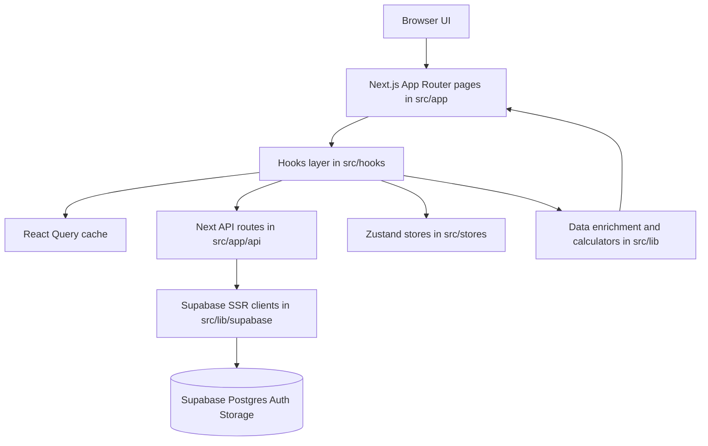
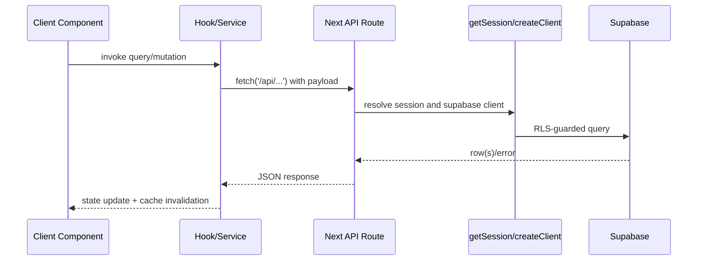
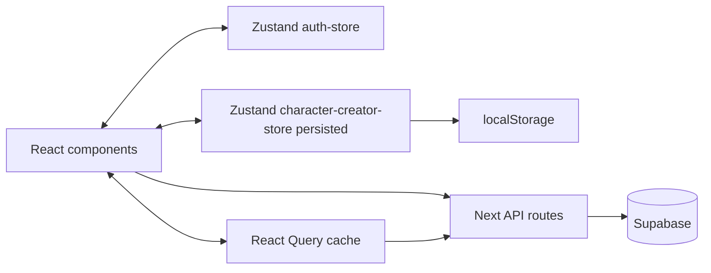

# RealmsRPG Engineering Onboarding

Technical onboarding guide for engineers new to this codebase.

This document is intentionally focused on architecture, runtime behavior, data flow, and safe implementation patterns. It is not a game design or business-rules document.

---

## 1) Stack and Runtime Model

- Framework: Next.js App Router (`src/app`) with React 19 and TypeScript.
- Styling: Tailwind CSS with design tokens in `src/app/globals.css`.
- State:
  - Server state and caching: TanStack Query.
  - Client app state: Zustand (`auth`, `character creator`).
  - Local persistence: browser storage (Zustand persist and creator cache utilities).
- Backend: Supabase (Postgres + Auth + Storage), accessed through Next API routes and Supabase SSR clients.
- Deployment target: Vercel.
- Database approach: SQL-only migrations in Supabase. No Prisma.

---

## 2) High-Level Architecture

Key idea: most UI reads/writes go through hooks -> API routes -> Supabase. Codex/library/character display often passes through enrichment/calculator utilities before rendering.

---

## 3) Directory Map (What Each Significant Directory Is For)

### `src/app`

- Route tree and API endpoints.
- Route groups:
  - `src/app/(main)` for authenticated app surfaces (characters, codex, library, creators, campaigns, admin, etc).
  - `src/app/(auth)` for login/register/credential recovery.
- API routes are under `src/app/api/**/route.ts`.
- Root layout `src/app/layout.tsx` wires providers in this order:
  - theme provider
  - query provider
  - auth provider
  - toast provider

### `src/components`

- `ui/`: primitive reusable UI building blocks (`Modal`, `Button`, `Input`, etc.).
- `shared/`: cross-feature patterns (`GridListRow`, list headers/filters, steppers, modals, helpers).
- Feature-specific component folders:
  - `character-sheet/`
  - `character-creator/`
  - `creator/` (power/technique/item/creature creator shared sections)
  - `codex/`
  - `layout/`

### `src/hooks`

- Main integration surface for UI components.
- Contains domain hooks for:
  - auth/session state (`use-auth`)
  - codex data (`use-codex`)
  - user library (`use-user-library`)
  - characters (`use-characters`)
  - auxiliary features (campaigns, encounters, tooltips, crafting, etc.)
- Also contains compatibility/legacy naming (`use-rtdb.ts`) that now reads Supabase-backed codex data.

### `src/services`

- Client-side API service wrappers (for example `character-service.ts`, `library-service.ts`).
- Mainly fetch wrappers and DTO shaping; business logic should still stay in shared `lib` utilities and API routes.

### `src/stores`

- Zustand stores:
  - `auth-store.ts`: auth user/loading/error/initialized.
  - `character-creator-store.ts`: multi-step character creation state and local persistence.

### `src/lib`

- Data and computation layer:
  - Supabase client helpers (`lib/supabase/*`).
  - Data shaping (`library-columnar.ts`, `data-enrichment.ts`).
  - API utilities/validation/rate limiting.
  - Game calculations and formula helpers (`lib/game/*`, `lib/calculators/*`).
- If a field appears in both JSON payload and scalar columns, conversion and precedence logic usually lives here.

### `src/types`

- Shared TypeScript models used across app/hooks/services/routes.
- Some names are legacy from earlier data layers; verify implementation before assuming semantics.

### `src/docs`

- Engineering source-of-truth docs.
- Important references:
  - `SUPABASE_SCHEMA.md` (DB schema source of truth)
  - `DATA_HANDLING.md` (query keys/cache/invalidation conventions)
  - `ARCHITECTURE.md` (data flow overview)
  - `GAME_RULES.md` (terminology/formulas/display conventions)

---

## 4) Data Layer: Where It Is and How It Works

## 4.1 Supabase clients and auth/session

- Browser client: `src/lib/supabase/client.ts`.
- Server client (cookie-aware): `src/lib/supabase/server.ts`.
- Session helper for server routes/actions: `src/lib/supabase/session.ts`.
- Request-time session refresh is handled via Next proxy (`src/proxy.ts` -> `updateSession` in `src/lib/supabase/middleware.ts`).

Important: `src/proxy.ts` matcher intentionally excludes high-volume public/static paths (`/api/codex`, `/api/public`, image/static assets) to reduce edge request load.

## 4.2 API route pattern

Most writes and authenticated reads follow this pattern:

API conventions in this repo:

- Validate request payloads via shared schemas (`validateJson`).
- Per-endpoint rate limiting (`standardLimiter`) on mutating routes.
- Session gates in routes (`getSession`) before DB access.
- DB table access via `supabase.from('table')` only.

## 4.3 Codex data model and fetch strategy

- Codex endpoint: `GET /api/codex` (`src/app/api/codex/route.ts`).
- Codex hooks (`src/hooks/use-codex.ts`) all share query key `['codex']`.
- Consumers use `select` in hooks to slice the shared payload (feats, skills, parts, species, archetypes, etc.).
- This prevents duplicate full-codex fetches when multiple components subscribe.

## 4.4 User library and columnar conversion layer

- User library APIs: `src/app/api/user/library/[type]` and `[type]/[id]`.
- Columnar helper: `src/lib/library-columnar.ts`.
  - Converts DB row -> client shape (`rowToItem`).
  - Converts request body -> scalar columns + payload JSON (`bodyToColumnar`).
- Types with mixed/legacy handling (notably species) include compatibility paths for older `data` blobs.

## 4.5 Characters

- Routes:
  - `GET/POST /api/characters`
  - `GET/PATCH/DELETE /api/characters/[id]`
- Character table shape is hybrid (list columns + JSONB data payload).
- Character list columns are derived at write time for faster list rendering/filtering.

---

## 5) State Model and Persistence

### Client state categories

- **Auth UI/session state** (`auth-store` + `useAuth`)
  - Initialized in `AuthProvider` on app mount.
  - Holds `user`, `loading`, `initialized`, `error`.
- **Character creator wizard state** (`character-creator-store`)
  - Persisted in localStorage under `character-creator-storage`.
  - Stores current step, completed steps, and draft.
- **Server state cache** (React Query)
  - Query cache lifetime and stale times vary by hook.
  - Codex data is cached aggressively via shared key.

### Additional local persistence helpers

- `useCreatorCache` / `useCreatorCacheValue` keep creator drafts in localStorage (30-day validity pattern).
- `useAutoSave` provides debounced persistence behavior and unload warning for dirty state.

---

## 6) Safe Edit Workflow for New Developers

1. Start from `src/docs/SUPABASE_SCHEMA.md` if your change touches data.
2. Locate existing hook/service for the feature before adding new data access.
3. Reuse existing query keys and invalidation patterns; avoid one-off fetch strategies.
4. Keep API route responsibilities:
   - auth check
   - validation
   - DB operations
   - clear error responses
5. Keep transformation logic in shared lib helpers when possible (`library-columnar`, enrichment, calculators).
6. Run `npm run build` before PR.

---

## 7) Gotchas You Should Know Early

- **Legacy names exist:** files like `use-rtdb.ts` are compatibility holdovers, but now use Supabase-backed data.
- **Do not create duplicate codex queries:** use existing `['codex']` hooks with `select`.
- **Species has compatibility handling:** both columnar and legacy `data`-style branches exist in user species flows.
- **Mixed scalar + payload fields:** some entities duplicate fields between dedicated columns and `payload`; precedence logic already exists in `library-columnar.ts`.
- **Proxy matcher exclusions are intentional:** avoid broadening middleware/proxy matching without considering edge request costs.
- **Auth state depends on initialization flags:** UI guards should rely on `initialized` and `loading`, not just `user`.
- **Service-role Supabase client bypasses RLS:** use only in authorized server-only contexts (for example admin or controlled server operations).
- **Schema docs are canonical:** rely on `SUPABASE_SCHEMA.md` for table/column truth, not stale comments or old migration assumptions.

---

## 8) Practical "Where Do I Change X?" Cheatsheet

- New page/route: `src/app/(main)` (or `src/app/(auth)`).
- New API endpoint: `src/app/api/<feature>/route.ts`.
- Add/modify DB read-write flow used by UI:
  - Hook in `src/hooks`
  - Service wrapper in `src/services` if needed
  - API route in `src/app/api`
- Change data shaping between DB and UI: `src/lib/library-columnar.ts`, `src/lib/data-enrichment.ts`.
- Adjust global state: `src/stores/*`.
- Update schema assumptions: `src/docs/SUPABASE_SCHEMA.md` and related SQL.

---

## 9) Recommended First Read Order (90-minute Ramp)

1. `src/docs/SUPABASE_SCHEMA.md`
2. `src/docs/DATA_HANDLING.md`
3. `src/docs/ARCHITECTURE.md`
4. `src/app/layout.tsx` and `src/proxy.ts`
5. `src/hooks/use-codex.ts`, `src/hooks/use-user-library.ts`, `src/hooks/use-characters.ts`
6. `src/app/api/codex/route.ts`
7. `src/app/api/user/library/[type]/route.ts`
8. `src/app/api/characters/route.ts`
9. `src/lib/library-columnar.ts`
10. `src/stores/auth-store.ts`, `src/stores/character-creator-store.ts`

After this sequence, you should be able to safely implement most UI, hook, and API changes without introducing data-layer regressions.

