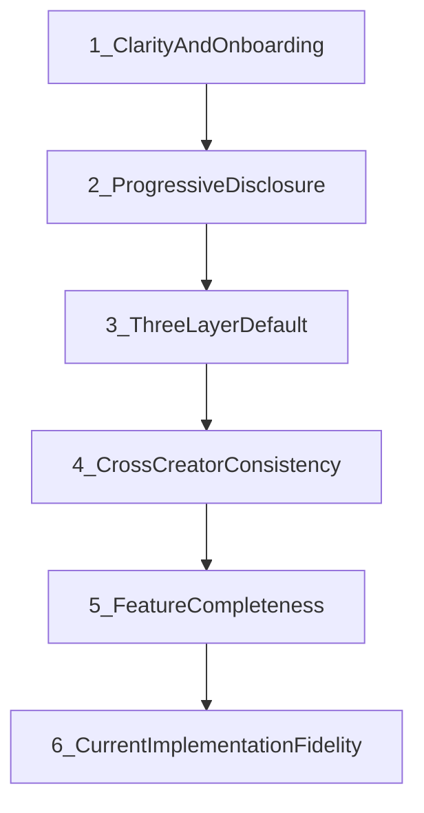
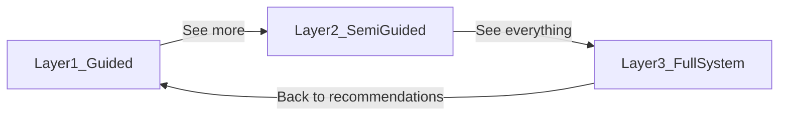
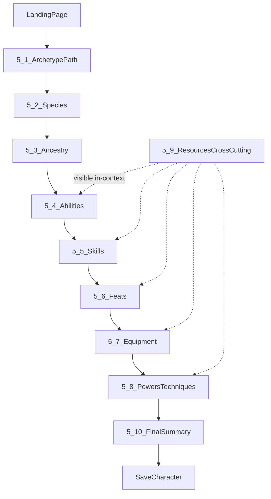
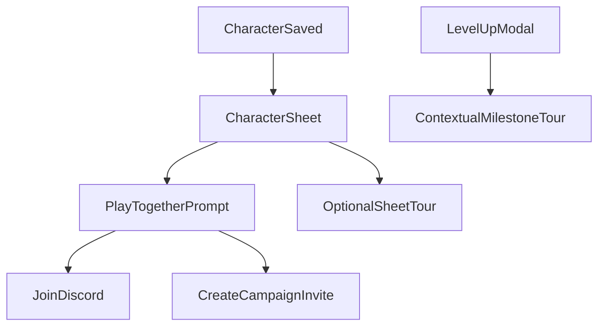
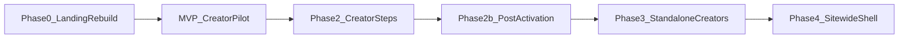

# Product Experience Redesign (Sitewide UX Vision)

> **Purpose:** The canonical north-star for the **desired** Realms web app experience — from a modern landing page through guided character creation, post-creation play prompts, contextual sheet/level-up help, and eventually **every creator, tool, tracker, and page**. This is a **vision and decision-hierarchy** document, not a record of current implementation.
>
> **Scope:** Character creator is the highest-priority onboarding surface, but this vision applies **sitewide**. Implementation proceeds **one page at a time** while preserving unified UI, familiar layouts, and the design system where it supports the goal.
>
> **Audience:** Product owner, engineers, and AI agents working on UX, onboarding, the character creator, or any creation/selection surface.
>
> **This doc is NOT:** game rules (see [`GAME_RULES.md`](./GAME_RULES.md)), database schema (see [`SUPABASE_SCHEMA.md`](./SUPABASE_SCHEMA.md)), component API reference (see [`DESIGN_SYSTEM.md`](./DESIGN_SYSTEM.md)), or a feature inventory (see [`ai/FEATURE_INDEX.md`](./ai/FEATURE_INDEX.md)).
>
> **Related:** [`human/USER_EXPERIENCE_GOALS.md`](./human/USER_EXPERIENCE_GOALS.md) is the **shipped-UX checklist** (terminology, guest gating, retention tactics). This document is the **vision**; that document tracks what is implemented. When they disagree, this document describes the target and that one describes today.

**Last updated:** 2026-06-28 (Appendix H: UX critique backlog for pre-implementation review)

---

## Section 1 — Vision Statement

> This document defines the **desired** user experience for Realms, not the current implementation.

The goal is to redesign the **entire web application experience** — landing page, character creation, post-creation play prompts, character sheet and level-up guidance, standalone creators, play tools, and every other surface — so that it prioritizes **clarity**, **progressive discovery**, and **user confidence**.

**A user arriving at Realms should:**

- Immediately understand what Realms is and why it is unique
- Feel excited and confident to begin playing
- Enter a guided, step-by-step character creation experience
- Never feel overwhelmed by system complexity
- Always know what to do next
- Feel like they are **becoming** their character through the process
- Maintain full optional access to deeper complexity without being forced into it

**System principle:** *Complexity available, not imposed.*

### What Realms is

Realms is a tabletop role-playing game (TTRPG) built for ultimate creative freedom. The web app is its **digital companion**: it handles character creation, serves as the reference for official content (the Realms Codex and Realms Library), and provides play tools — Encounters, Campaigns, Crafting, and Creators for Realm Masters and players who want to build custom content.

### Pillars

- **Game pillars (from the Core Rulebook):** freedom in player creativity and customization; engaging and fluid gameplay; fun first, flavor second, rules third.
- **Web app pillars (product-specific):**
  - **Guided by default, full system always reachable** — the three-layer model in Section 3.
  - **Learn once, use everywhere** — the same selection grammar across the character creator, standalone creators, library, codex, and crafting.
  - **Official content first-class** — Realms Codex and Realms Library are "what's in the game," not "pre-made" or "public."
  - **Account at value, not at door** — guests can browse the Codex, read the Realms Library, and build a character; an account is required only to save.

### Primary emotional goal

> "I am naturally becoming my character through a guided process that never overwhelms me."

### Anti-goal

Exposing the full rules engine on first contact. The system should make complexity **available**, never **imposed**.

Terminology is defined in [`src/lib/constants/site-copy.ts`](../lib/constants/site-copy.ts) (`REALMS_MOTTO` — "Your new favorite roleplaying game") and in [`human/USER_EXPERIENCE_GOALS.md`](./human/USER_EXPERIENCE_GOALS.md) section 1.2 (Realms Codex, Realms Library, My Library).

### Non-negotiable design rule (stated up front, repeated in Section 10)

> If any UX decision conflicts with **clarity**, **onboarding simplicity**, or **progressive disclosure**, those principles override all other considerations — including existing system structure, current step order, and feature completeness.

---

## Section 2 — Core UX Philosophy

Each principle below carries a **decision rule** for resolving tradeoffs in the moment.

| Principle | Meaning | Decision rule |
|-----------|---------|---------------|
| **2.1 Progressive discovery over full exposure** | Complexity is revealed only as needed | Default to the smallest viable choice set; never lead with the full codex or full library |
| **2.2 Guided decision flow** | A single clear next action at all times | Every screen has one primary call to action plus visible step progress |
| **2.3 Reduced cognitive load** | Minimize simultaneous decisions | Split compound steps (weapon, then armor); hide sub-skills and resource math in Layer 1 |
| **2.4 Confidence-driven progression** | The user feels "I understand this," "I know what to choose," "I know what's next" | Show per-step completion indicators, not only validation errors on Continue |
| **2.5 System transparency without overload** | Choices are explained in context | First-exposure tooltips via Collin's Tippy pattern (see Section 2.6); no external documentation required to complete the Layer 1 flow |

### 2.6 Contextual help — Tippy tooltips (Collin / TASK-376)

In-context explanation is central to this UX vision. **Follow Collin's established Tippy approach** as the only tooltip standard:

- `@tippyjs/react` + copy in `public/tooltip-text.tsx`
- `Info` icon triggers; static, reviewable copy
- Replace the legacy DB tooltip stack entirely (`ui_tooltips`, `useTooltipByKey`, `ContextHelpTooltip`)

**TASK-376 is Collin Morrison's assignment — AI agents must not implement the migration.** Agents may **use** Tippy where Collin has already landed it (character creator steps, header); do not extend the legacy system. UX work that needs new tooltip copy should coordinate with Collin's pattern and file structure. See [`ai/AGENT_GUIDE.md`](./ai/AGENT_GUIDE.md) section Tooltips and `DEVELOPER_TASK_QUEUE.md` → COLLIN-001.

First-exposure tooltips in the guided creator flow depend on TASK-376 progressing; plan Layer 1 copy to slot into `tooltip-text.tsx` as Collin migrates each surface.

### Decision hierarchy (for agents when principles conflict)

When two valid designs collide, resolve in this order — earlier wins:



In plain terms: clarity and onboarding beat progressive disclosure; both beat keeping a strict three-layer default; all of those beat cross-creator consistency; and every one of them beats feature completeness or fidelity to how the system is built today.

---

## Section 3 — Three-Layer Interaction Model (Global UX System)

Every creator and selection system **must** follow this structure. It is the core mechanism that makes "complexity available, not imposed" real.

| Layer | Name | Audience | Behavior |
|-------|------|----------|----------|
| **1** | Guided (default) | First-time users | Path-driven groups, pre-selection where safe, strong contextual explanation, minimal visible options |
| **2** | Semi-guided | Intermediate users | Options filtered by current build state, ranked recommendations on top, expanded choices available but not dominant |
| **3** | Full system | Experienced users | Complete unrestricted lists, full customization, advanced configuration |

### Rules

- **Default entry is always Layer 1.**
- Provide an explicit affordance to expand: "See more options" moves to Layer 2; "See everything" / "See all" moves to Layer 3.
- Always allow a return to Layer 1: "Back to recommendations."
- **Forge Your Own** is the global Layer 3 escape hatch for the character creator (`creationMode: 'forge'` in [`character-creator-store.ts`](../stores/character-creator-store.ts)). Never remove it; never make it the default for the first-time flow.



### Future shared component (specification only)

The layer pattern is currently re-implemented per step. The target is a single shared component, `GuidedChoiceShell`, at `src/components/shared/guided-choice/`, that unifies the patterns split across:

- [`feats-step.tsx`](../components/character-creator/steps/feats-step.tsx) — `usePathRecommendations` toggle
- [`equipment-step.tsx`](../components/character-creator/steps/equipment-step.tsx) — `showFullEquipmentList` toggle
- [`powers-step.tsx`](../components/character-creator/steps/powers-step.tsx) plus [`unified-selection-modal.tsx`](../components/shared/unified-selection-modal.tsx)
- [`PathHelpCard.tsx`](../components/character-creator/PathHelpCard.tsx) — evolve into a step-level guidance and completion surface

Proposed contract (props): `layer`, `groups[]`, `onExpandLayer`, `onCollapseLayer`, `completionState`, `primaryAction`. Implementation is Phase 3; this document only specifies it.

### Current state: most creators are Layer 3 today

**Today, standalone creators and many selection surfaces expose the full system by default** — effectively Layer 3 UX everywhere (power creator, technique creator, item creator, species creator, creature creator, and similar). The redesign must **introduce Layer 1 and Layer 2** on each creator over time, not only on the character creator.

| Surface | Target layers | Current default |
|---------|---------------|-----------------|
| Character creator (path mode) | L1 partial on some steps | Mixed; forge = L3 |
| Power / technique / item creators | L1 templates → L2 filtered parts → L3 full | **L3 only** |
| Species / creature creators | L1 guided picks → L2 → L3 | **L3 only** |
| Encounters, campaigns, crafting | L1 task-focused → L2 → L3 | **L3 / dense UI** |
| Codex / Library browse | L1 curated → L2 filtered → L3 full tables | **L3 browse** |

Landing-page secondary CTAs for "create a custom power" and "create custom weapons and armor" must route into those creators' **Layer 1 entry**, not the current full builder.

---

## Section 4 — Landing Page (full redesign)

**Decision:** Scrap and rebuild [`home-page.tsx`](<../app/(main)/home-page.tsx>) — not incrementally patch the current layout. Target a **modern, marketing-research-aligned TTRPG startup landing page** that follows Realms pillars and the single-primary-CTA discipline.

### What to remove from the current home page

- **`OnboardingTour`** and "Take a quick tour" — pre-creation product tours add friction before value; remove from home (see Section 11 for post-activation guidance instead).
- **Logged-in welcome banner** with many parallel links — replace with a minimal continue/create prompt if needed, never competing with the hero CTA.
- **Low-yield CTAs:** "Browse Codex," "Browse Realms Library," and similar reference-first links — **remove from the landing page**. Codex and Library remain reachable via nav for users who seek them; they are not conversion paths for first visits.
- **Review carousel / feature sprawl** if it dilutes the primary message — replace with one strong proof block or social proof section, not many equal-weight cards.

### Research-backed landing structure (TTRPG / hobby product)

Apply patterns common to high-converting hobby and TTRPG product pages (AIDA flow, progressive scroll story, mobile-first):

| Block | Role | Realms application |
|-------|------|-------------------|
| **Hero** | Attention + single action | One headline (what Realms is + why unique), one subline, **one primary CTA** |
| **Uniqueness** | Interest / desire | Concrete differentiators — custom powers, path-guided builds, creative freedom — with **visual proof** (screenshots, species art, power examples), not abstract ad copy |
| **How it works** | Desire | 2–3 steps: choose a path → become your character → play with friends |
| **Social proof** (optional) | Trust | Short quotes or community signal; TTRPG audiences respond to specificity and peer voice |
| **Secondary discovery** (below fold) | Interest for customizers | **Create a custom power** → `/power-creator` (Layer 1 entry); **Create weapons & armor** → `/item-creator` (Layer 1 entry) — brief, visual, not equal to hero CTA |
| **Community** (footer area) | Action for non-ready visitors | **Join Discord** — secondary CTA for users not ready to create yet |

**Marketing principles to follow:**

- **One primary CTA above the fold:** "Start Playing" / "Create Your Character" → `/characters/new` (path-first creator). Repeat once after the uniqueness block; avoid nav-bar-style link farms.
- **Show the product in use** — character art, creator UI, table/play context — so visitors picture themselves playing (not just reading rules).
- **Mobile-first** — majority of discovery happens on small screens; hero and CTA must work at ~360px without horizontal hunting.
- **No feature dump on first screen** — defer deep mechanics; link to `/rules` or About for researchers, not from the hero.
- **Community-aware language** — "Start playing," "Create your character," not enterprise SaaS tone.

### CTA hierarchy (final)

| Priority | CTA | Destination | Notes |
|----------|-----|-------------|-------|
| **Primary** | Start Playing / Create Your Character | `/characters/new` | Hero + one repeat mid-page |
| **Secondary (mid-page, below fold)** | Create a Custom Power | `/power-creator` | Must land in **Layer 1** guided entry when built |
| **Secondary (mid-page)** | Create Weapons & Armor | `/item-creator` | Same — Layer 1 when built |
| **Tertiary** | Join Discord | External invite | Footer or closing section; for not-ready-yet visitors |
| **Removed from landing** | Browse Codex, Browse Library, Take a tour | — | Nav only |

### Success metrics

- New visitor answers "what is Realms and why is it different?" in ~10 seconds **without scrolling**.
- One obvious button to start playing; no decision paralysis from equal-weight CTAs.
- Design tokens and components from [`DESIGN_SYSTEM.md`](./DESIGN_SYSTEM.md) and [`MOBILE_UX.md`](./MOBILE_UX.md) — modern layout, not a break from the system unless the system must evolve to support the vision.

### Current gap

Today's home page mixes hero, reviews, multiple feature cards, welcome banner, onboarding tour trigger, and Codex/Library CTAs — the opposite of this spec.

---

## Section 5 — Character Creation UX Flow

Character creation is the **primary onboarding experience** and must be fully guided.

**Current step order** (`STEP_ORDER` in [`character-creator-store.ts`](../stores/character-creator-store.ts)): archetype → species → ancestry → abilities → skills → feats → equipment → powers → finalize.

**Target flow** (vision reconciled with the codebase):



Ancestry remains an explicit step (an exciting identity moment, backed by [`ancestry-step.tsx`](../components/character-creator/steps/ancestry-step.tsx)). Resource clarity (5.9) is cross-cutting rather than a standalone step.

Each subsection below should ultimately be expanded using the page-spec template in Appendix A. Gap tables reference the verified current behavior in Appendix B.

### 5.1 Entry: Archetype / Path Selection

The user begins by choosing an archetype (a **path**).

**Valid hesitation:** "Which direction do I want to play?"

**Invalid hesitation:** "What is an archetype?" / "What does this mean?" / "Where do I click?" / "How do I scroll?"

| Requirement | Target |
|-------------|--------|
| Visually distinct choices | Path cards with image or icon, a one-line role identity, and a build preview |
| No prior terminology required | Plain language ("Choose your path") over system jargon ("Select archetype category") |
| Minimal scrolling or searching | Grouped by Power / Powered-Martial / Martial; paginated if the list is long |
| Layer 1 default | Path selection is primary; "Forge Your Own" is the Layer 3 entry point |

**Current gap:** [`archetype-step.tsx`](../components/character-creator/steps/archetype-step.tsx) offers the fork and path cards but no recommendation preview on the cards.

### 5.2 Species Selection

The user selects a species. The feeling to evoke: "I see who I am becoming."

| Requirement | Target |
|-------------|--------|
| Images are essential | Image-forward grid; species identity readable at a glance |
| Hover and tooltips for detail | No modal required to understand the basics |
| Layer 1 | Grid cards carry an inline stats and traits summary |

**Current gap:** Modal-heavy ([`species-modal.tsx`](../components/character-creator/species-modal.tsx)); a click is required to understand each option.

### 5.3 Ancestry (identity step)

The user makes their species their own through ancestry traits, flaws, and characteristics. This should feel exciting, not confusing.

| Requirement | Target |
|-------------|--------|
| Exciting, not confusing | Guided trait / flaw / characteristic picks, one decision at a time |
| Clear completion | The user never hunts for a missing pick; a step checklist shows what remains |
| Path integration (future) | Optional path-flavored copy; species traits remain the player's choice |

**Current gap:** [`ancestry-step.tsx`](../components/character-creator/steps/ancestry-step.tsx) has no path guidance, and mixed-species selection is high in complexity.

### 5.4 Ability Allocation

The user assigns abilities, understanding what each one does and which their path favors.

| Requirement | Target |
|-------------|--------|
| What each ability affects | In-context blurbs (Vitality affects life; Agility affects speed and the Evasion defense; and so on) |
| Path guidance | Primary and secondary abilities auto-highlighted; an optional one-click suggested array in Layer 1 |
| Layer 2 / 3 | Free point-buy as today via [`ability-score-editor.tsx`](../components/creator/ability-score-editor.tsx) |

**Current gap:** [`PathHelpCard`](../components/character-creator/PathHelpCard.tsx) provides a text nudge only — no auto-allocation or preset.

### 5.5 Skills Selection

Skills must be structured to avoid overwhelm.

| Requirement | Target |
|-------------|--------|
| Origin labeling | Species skills, path skills, and free picks are visually distinct |
| Sub-skills | Hidden in Layer 1; available in Layer 2 / 3 for experienced players |
| Path copy | Role framing, e.g. "Intimidate and Athletics are a warrior's bread and butter" |
| Easy add and remove | Species skills are locked; path skills are toggleable |

**Current gap:** The full [`skills-allocation-page.tsx`](../components/shared/skills-allocation-page.tsx) shows sub-skills and defense allocation on one screen.

### 5.6 Feat Selection

Feat selection must be heavily guided.

| Requirement | Target |
|-------------|--------|
| Archetype-based grouping | Build-goal groups ("Sturdy tank," "Intimidator") with short why-copy |
| Two phases within the step | Archetype feats first (combat and system impact), then a character feat (identity and expression) |
| Layer 1 to 2 to 3 | Grouped recommendations, then a filtered ranked list, then the full catalog |
| Nothing gated in Layer 1 | Every feat remains reachable by expanding |

**Current gap:** [`feats-step.tsx`](../components/character-creator/steps/feats-step.tsx) uses a Layer 1 filter and auto-apply but has no build-goal groups.

### 5.7 Equipment Selection

Equipment selection follows archetype guidance and is split into one decision at a time.

| Requirement | Target |
|-------------|--------|
| Role-based loadouts | The path suggests a coherent loadout (sword and shield, greataxe, and so on) |
| Simple visual grouping | Weapon types and armor types as chips or cards |
| Sub-step split (target) | Weapon decision first, then armor decision |
| Layer 1 | The path loadout fits naturally; Training Points and currency are invisible in the guided flow |

**Current gap:** A single [`equipment-step.tsx`](../components/character-creator/steps/equipment-step.tsx) with manual add and visible Training Points.

### 5.8 Powers / Techniques Selection

Powers and techniques follow the same unified pattern as the other steps.

| Requirement | Target |
|-------------|--------|
| Same unified pattern | Recommended, grouped, with an expand to the full list |
| Powered-martial clarity | Clear distinction between innate and regular; lower-energy recommendations for hybrids |
| Contextual synergy copy | Why a power fits the build's role |

**Current gap:** [`powers-step.tsx`](../components/character-creator/steps/powers-step.tsx) auto-merges recommendations but offers limited grouping and copy.

### 5.9 Resource Clarity (Training Points / Energy / Currency) — cross-cutting

Resource systems are explained where they first appear (across the abilities-adjacent steps: equipment, powers, finalize).

| Requirement | Target |
|-------------|--------|
| Visible but not overwhelming | A compact resource bar; explained on first encounter |
| Path auto-validation | Archetype paths are pre-validated in admin; a Layer 1 player never overspends |
| No manual calculation | "Included in your path" framing in Layer 1 |
| Tooltips | Training Points, currency, and Energy defined in context |

**Data need:** Admin path-builder validation (Appendix C).

### 5.10 Final Character Summary

The final step delivers a fulfilling character reveal, then the identity details.

| Requirement | Target |
|-------------|--------|
| Full overview | Every choice is visible — species, path, feats, gear, powers |
| Editable adjustments | Jump back to any step without penalty |
| Identity fields | Name, age, height, weight (optional), portrait (from a library or uploaded) |
| Health / Energy allocation | Clear and guided ([`health-energy-allocator.tsx`](../components/creator/health-energy-allocator.tsx)) |
| Feel | "This is my finished character." |

**Current gap:** [`finalize-step.tsx`](../components/character-creator/steps/finalize-step.tsx) has a functional save flow but is not yet a fulfilling reveal.

---

## Section 6 — UX Unification Principle

Consistency across **all surfaces** is **mandatory** — this is a **sitewide** UX overhaul, not a character-creator-only project. Surfaces share:

- The same step-by-step structure where applicable
- The same progression logic (guided → semi-guided → full)
- The same "recommended plus expand for more" pattern
- Familiar layouts and unified components ([`DESIGN_SYSTEM.md`](./DESIGN_SYSTEM.md), [`ai/UI_UNIFICATION_PLAN.md`](./ai/UI_UNIFICATION_PLAN.md)) even as each page is redesigned

### Implementation strategy: one page at a time

- **Do not** big-bang rewrite every route at once.
- **Do** pick a page, apply this document's principles, ship, then move to the next.
- **Priority order (recommended):**
  1. Landing page (Section 4) — full rebuild
  2. Character creator (Section 5) — highest confusion risk for new players
  3. Standalone creators (power, technique, item) — currently Layer 3 only; add L1/L2
  4. Character sheet + post-activation flow (Section 11)
  5. Encounters, campaigns, crafting, creature/species creators
  6. Codex / Library browse (reference surfaces; lower landing priority)

Each page refactor must still feel like one product: same step chrome, same layer expand/collapse affordances, same tooltip pattern (Tippy).

**Surfaces to unify (phased):**

1. Character creator (Phases 1–2)
2. Standalone creators: power, technique, item, species, creature (see [`ai/FEATURE_INDEX.md`](./ai/FEATURE_INDEX.md))
3. Crafting ([`crafting/page.tsx`](<../app/(main)/crafting/page.tsx>))
4. Realms Library and Codex browse (Layer 1 curated → Layer 2 filtered → Layer 3 full tables)

Tie **visual** consistency to [`ai/UI_UNIFICATION_PLAN.md`](./ai/UI_UNIFICATION_PLAN.md); tie **interaction** consistency to this document.

---

## Section 7 — Key Navigation Philosophy

At all times the user must:

- Know **what step** they are on ([`creator-tab-bar.tsx`](../components/character-creator/creator-tab-bar.tsx))
- Know **what comes next**
- Be able to **go back without penalty** ([`creator-step-footer.tsx`](../components/character-creator/creator-step-footer.tsx))
- **Never lose their place or context** — the draft persists through Zustand and localStorage

Soft validation ("Continue anyway") is acceptable for the Forge / Layer 3 flow. The path-driven Layer 1 flow should guide the user to completion before Continue is enabled.

---

## Section 8 — Critical UX Constraints

Consolidated non-negotiables:

- Do **not** expose full system complexity upfront.
- Do **not** overwhelm the user with all options at once.
- Do **not** require prior system knowledge.
- Do **not** prioritize feature completeness over clarity.
- **Always** prefer guidance over raw freedom in the early experience.
- **Always** reduce visible choices in the early stages.
- Do **not** propose feature expansion unless it directly reduces user confusion or decision fatigue. Prefer removal, simplification, or restructuring over addition.

---

## Section 9 — Required Output From the UX Redesign Process

This section maps each required deliverable to where it lives in this document. The document satisfies the design deliverables; implementation follows in the migration phases.

| Deliverable | Location |
|-------------|----------|
| Full user flow, landing → character → play | Sections 4, 5, 11 |
| Page-by-page UX structure | Section 5 subsections, Section 4, Appendix A template |
| Sitewide rollout order | Section 6 |
| Post-activation and milestone tutorials | Section 11 |
| Component-level design rules | Appendix D |
| UI interaction patterns (modals, tooltips, selectors) | Appendix D, Section 2.6 |
| Data model implications (UX-driven only) | Appendix C |
| Migration strategy | Appendix E |
| Simplification for high-complexity areas | Appendix F |
| Minimum viable redesign | Appendix E, "MVP" |

---

## Section 10 — Non-Negotiable Design Rule

> If any UX decision conflicts with **clarity**, **onboarding simplicity**, or **progressive disclosure**, those principles override all other considerations — including existing system structure, current step order, and feature completeness.

This rule exists to prevent designs that are faithful to the current implementation but hostile to a first-time user. When in doubt, simplify.

---

## Section 11 — Post-activation journey (after character creation)

Character creation is the **activation milestone** — the "aha moment." Guidance **after** save should not repeat pre-creation tours; it should capitalize on completed activation energy and move users toward **playing together**, which is Realms' core social value.

### 11.1 Immediate post-save: "Play together"

After first character save, redirect to the character sheet and show a **one-time prompt** (dismissible, stored in profile or localStorage):

- **Message theme:** "You've built your character — Realms is most fun with a party."
- **Primary actions:**
  - **Join Discord** — find groups and community
  - **Start a campaign** — create a campaign and invite friends (link to `/campaigns` or create flow)
- **Not:** send them back to Codex/Library browse.

Show for first-time players (first saved character); optional "don't show again." Logged-in users who already dismissed skip it.

**Best practice:** Trigger on **behavior** (character saved), not on home-page load. One modal or banner, not a multi-step tour.

### 11.2 Character sheet tutorial (optional, post-activation)

**When:** After the user has a saved character — activation hurdle cleared — offer an **optional** "Learn your sheet" flow.

**Why now:** Pre-creation tours fail because users lack context. Post-creation, they have a character to relate to; sheet concepts (abilities, roll log, powers, resources) land better.

**Content (short, skippable):**
- What each major section is (abilities, skills, feats, library tabs)
- How to roll (roll log)
- Where to edit vs view
- How to find help (Tippy tooltips on sheet)

**UX pattern:**
- Offer once: "Take a quick tour of your sheet?" with **Skip** and **Don't show again**
- Not auto-play on every visit
- User setting: **tutorials on/off** (account or local preference) for all contextual tours

**Remove** the current home-page `OnboardingTour` (Codex → Library → Creator) — it front-loads reference browsing before value.

### 11.3 Level-up contextual tutorials (progressive, milestone-based)

When a character **levels up for the first time**, and again when a level introduces **something new** the player has not seen, offer a **contextual mini-guide** scoped to what changed — not a full product tour.

| Milestone | New concept | Tutorial scope |
|-----------|-------------|----------------|
| First level-up ever | Updating stats from a level | Health, energy, skill points, new feat slots — only fields affected by this level |
| First ability point (e.g. level 3) | Ability allocation on sheet | Where to spend the point; what each ability affects (Tippy) |
| First new power/technique slot | Adding to library from sheet | How to add powers; Layer 1 path guidance if applicable |
| Later levels | Only **delta** | "At this level you gain X" — tour covers X only |

**Rules (aligned with NN/g progressive disclosure and SaaS onboarding research):**

- **Never** repeat full sheet tour on every level-up.
- **Always** skippable; respect global "tutorials off."
- **Trigger on milestone** (first time this level-up type occurs for this character or account), not calendar time.
- Prefer **highlight + one Tippy chain** over modal-heavy walkthroughs.
- Celebrate completion lightly ("You're ready to play at level N") — no gamified achievement spam.

**Implementation note:** Track `tutorial_milestones` per user or character (e.g. `seen_first_level_up`, `seen_ability_point_level_3`) in character metadata or user profile JSON. Exact storage TBD in implementation task.

### 11.4 Post-activation flow diagram



---

## Appendix A — Page spec template

Use this template to expand each step in Section 5 as it is implemented:

```
### Step: <Name>
Purpose (why this step exists):
Primary decision (one sentence):
Layer 1 UI structure (header, guidance, choice groups, completion, footer):
Layer 2 trigger and behavior:
Layer 3 trigger and behavior:
Path-specific copy patterns (example strings for one reference path):
Completion rules (when Continue enables; what "done" looks like visually):
Back / edit behavior:
Tooltip / first-exposure concepts:
Current state vs target (gap table):
Key files:
Data dependencies:
```

---

## Appendix B — Current implementation index

Verified against the codebase (June 2026). Files are under `src/components/character-creator/`.

| Step | File | Path mode today |
|------|------|-----------------|
| Archetype | `steps/archetype-step.tsx` | Fork (Choose a Path / Forge Your Own) plus path picker |
| Species | `steps/species-step.tsx` | No path integration |
| Ancestry | `steps/ancestry-step.tsx` | No path integration |
| Abilities | `steps/abilities-step.tsx` | `PathHelpCard` text nudge only |
| Skills | `steps/skills-step.tsx` | Auto-adds recommended skills; toggle to decline |
| Feats | `steps/feats-step.tsx` | Layer 1 filter plus auto-apply of recommended feats |
| Equipment | `steps/equipment-step.tsx` | Chip add plus full-list toggle |
| Powers | `steps/powers-step.tsx` | Auto-merge of recommended powers and techniques |
| Finalize | `steps/finalize-step.tsx` | Save plus Health/Energy allocation |

Path data and logic: [`src/types/archetype.ts`](../types/archetype.ts), [`src/lib/game/archetype-path.ts`](../lib/game/archetype-path.ts), and the `codex_archetypes` plus `codex_archetype_levels` tables (see [`SUPABASE_SCHEMA.md`](./SUPABASE_SCHEMA.md)). The creator applies level-1 recommendations only; higher levels feed level-up and sheet guidance.

### Sitewide surfaces — layer default today

| Surface | Route / file | UX layer today | Target |
|---------|--------------|----------------|--------|
| Home | `home-page.tsx` | Multi-CTA, onboarding tour | Section 4 rebuild |
| Character creator (forge) | `characters/new` | Layer 3 | Layer 1 path default |
| Power creator | `power-creator/page.tsx` | Layer 3 | L1 templates → L2 → L3 |
| Technique creator | `technique-creator/page.tsx` | Layer 3 | Same |
| Item creator | `item-creator/page.tsx` | Layer 3 | Same; landing CTA entry |
| Species / creature creators | `species-creator`, `creature-creator` | Layer 3 | Guided L1 when prioritized |
| Character sheet | `characters/[id]` | Dense full UI | Optional post-save tour (Section 11) |
| Encounters | `encounters/` | Full tracker UI | Phased simplification |
| Campaigns | `campaigns/` | Full UI | Post-save CTA target |
| Crafting | `crafting/` | Full UI | L1 recipes when prioritized |
| Codex / Library | `codex`, `library` | Full browse (L3) | Nav-only for landing; L1 curated later |

### Home page — remove on rebuild

| Remove | File / component |
|--------|------------------|
| Pre-creation onboarding tour | `OnboardingTour` in `home-page.tsx`, welcome "Take a quick tour" |
| Codex / Library hero CTAs | Feature cards linking to `/codex`, `/library` |
| Welcome banner link farm | Multi-link logged-in strip (replace with minimal continue/create) |

---

## Appendix C — Data model implications (UX-driven only)

Only changes that the UX requires. Do not expand the data model beyond reducing user confusion.

| UX need | Change | Status |
|---------|--------|--------|
| Grouped feat / power recommendations with copy | A `guidance_groups` structure on the path, or extend `ArchetypePathRecommendations` | New |
| Per-step path flavor text | A per-step `guidance` object, or surface the existing `level1_notes` | `level1_notes` exists but is **not shown in the creator** |
| Species path hints | An optional `recommended_species[]` on the path | Missing |
| Admin Training Points / currency validation | Validate that path loadouts stay within budget before publish | Missing in admin |
| Ability effect blurbs | A frontend constants map | New (no database change) |
| Equipment sub-steps | UI only; `armaments` and `equipment` are already separate fields | Ready |
| Tutorial milestone flags | `tutorial_milestones` on user profile or character JSON | New (Section 11) |
| Play-together prompt dismissed | User or character preference flag | New (Section 11) |

**Defer:** auto-applying level 2 and higher during creation; locking species by path; removing Forge mode.

---

## Appendix D — Component and interaction rules

- **Step chrome:** sticky footer, visible progress, a completion badge per step.
- **Modals:** used for Layer 2 and Layer 3 only; set `fullScreenOnMobile` (see [`MOBILE_UX.md`](./MOBILE_UX.md)). Never open the full library as the default view.
- **Tooltips:** contextual first-exposure via **Collin Tippy only** (Section 2.6); do not add legacy `ContextHelpTooltip`. New copy belongs in `public/tooltip-text.tsx`, coordinated with TASK-376.
- **Touch targets:** minimum 44 by 44 pixels.
- **Tokens:** semantic tokens only (see [`DESIGN_SYSTEM.md`](./DESIGN_SYSTEM.md)).
- **Grouped recommendations:** expandable sections with a one-line "why pick this" and an expand for full detail.
- **Completion indicators:** step-level "2 of 3 choices made," not only validation errors surfaced on Continue.

---

## Appendix E — Migration strategy and MVP

Refactor one step at a time behind `creationMode === 'path'`. Forge mode keeps its current UI until the Phase 3 unification.



| Phase | Scope | Ship criteria |
|-------|-------|---------------|
| **Phase 0** | **Full landing page rebuild** (Section 4): remove onboarding tour, Codex/Library CTAs, multi-CTA sprawl; single primary CTA; mid-page power/item creator teasers; Discord tertiary | Landing matches Section 4 spec; one obvious "Start Playing" path |
| **MVP** | Character creator pilot: archetype preview cards, Layer 1 feat groups, `level1_notes` in creator, one reference path | One martial path completable in Layer 1 without opening full lists |
| **Phase 2** | Remaining creator steps: species grid, ancestry guided flow, Layer 1 skills, equipment split, powers grouping | New player completes path unaided |
| **Phase 2b** | Post-activation (Section 11): play-together prompt, optional sheet tour, level-up milestone tutorials, tutorials on/off | First save → play prompt; sheet tour skippable; first level-up shows delta-only guide |
| **Phase 3** | Standalone creators gain L1/L2; landing CTAs land in guided entry | Power and item creators open in Layer 1 from landing links |
| **Phase 4** | `GuidedChoiceShell`, admin path validation, encounters/campaigns/crafting passes, codex/library L1 curated | Sitewide layer model; all published paths pass TP/currency checks |

**Dependency:** Contextual tooltips across new surfaces follow **TASK-376** (Collin). UX copy can be drafted in this doc and in `tooltip-text.tsx` as Collin migrates.

### MVP (implement first — split across tasks)

**Phase 0 (TASK-387):** Full landing rebuild per Section 4 — not a copy-only patch.

**Creator pilot (TASK-386):**

1. **Archetype step:** path cards show build preview; Path is default over Forge.
2. **Feats step (pilot):** Layer 1 grouped recommendations; "See all feats" → Layer 3.
3. **Global:** surface `level1.notes` via enhanced `PathHelpCard` on path steps.
4. **Content:** one fully authored reference martial path in admin.

**Post-activation (TASK-388):** play-together prompt after first save; optional sheet tour; milestone level-up guides (Section 11).

Everything else stays on current UI until each phase validates the pattern.

---

## Appendix F — High-risk complexity and simplification

| Risk area | Why it is hard | Simplification |
|-----------|----------------|----------------|
| Skills plus sub-skills plus defenses | Three systems on one screen | Layer 1: skills only; sub-skills in Layer 2; defenses deferred for path users |
| Feat requirement gating | Codex requirement rules overwhelm | Layer 1: pre-validated groups; requirements hidden until expand |
| Mixed species ancestry | Many parallel pickers | Layer 1: discourage mixed; full mixed in Layer 3 only |
| Training Points / currency / proficiency math | Resource anxiety | Path builds are pre-validated; present resources as "included" in Layer 1 |
| Powered-martial dual track | Two proficiencies plus innate powers | Split sections with path copy |
| Equipment catalog size | Scroll fatigue | Weapon then armor sub-steps |
| Empty path content in the database | The picker is empty | Content is a prerequisite; gate publish in admin |

---

## Appendix G — Links and glossary

**Related docs:** [`GAME_RULES.md`](./GAME_RULES.md), [`ai/FEATURE_INDEX.md`](./ai/FEATURE_INDEX.md), [`ARCHITECTURE.md`](./ARCHITECTURE.md), [`ai/UI_UNIFICATION_PLAN.md`](./ai/UI_UNIFICATION_PLAN.md), [`human/USER_EXPERIENCE_GOALS.md`](./human/USER_EXPERIENCE_GOALS.md).

**Terminology:** see [`human/USER_EXPERIENCE_GOALS.md`](./human/USER_EXPERIENCE_GOALS.md) section 1.2 for the canonical content-naming table (Realms Codex, Realms Library, My Library). Not duplicated here.

**Glossary (first-exposure concepts):**

- **Path / Archetype** — a guided character build direction (Power, Powered-Martial, or Martial), with level-1 recommendations.
- **Forge Your Own** — the unguided Layer 3 path that gives full control from the start.
- **Archetype feat** — a feat oriented toward combat and high-stakes situations.
- **Character feat** — a feat oriented toward identity and build expression.
- **Training Points (TP)** — the resource that bounds proficiency, weapon, and power investment.
- **Energy (EN)** — the resource that powers a character's powers.
- **Realms Codex** — the official reference of game data.
- **Realms Library** — the official collection of playable content; **My Library** is the user's own collection.

---

## Appendix H — UX critique & open questions (review before full rollout)

> **Status:** Owner review backlog — **not** part of the approved vision yet. Read this appendix before expanding tasks or starting a new implementation phase. Resolve or promote items into Sections 1–11 (or new sections) as decisions are made. Agents should not treat these as acceptance criteria until promoted.

**Purpose:** Critical evaluation of this document against TTRPG product patterns (D&D Beyond, Pathfinder digital tools), retention best practices, and the current codebase. Captures blind spots, risks, and suggested doc additions so the plan can be built top-to-bottom deliberately rather than discovered mid-implementation.

**Overall assessment (snapshot):**

| Lens | Rating | Summary |
|------|--------|---------|
| UX north star / philosophy | Strong | Three-layer model, decision hierarchy, progressive disclosure — correct for Realms complexity |
| Character creator vision | Strong | Path-first, step specs, honest gap tables |
| Complete product strategy | Incomplete | Personas, RM funnel, sheet-as-product, metrics, content ops under-specified |
| Implementation roadmap | Moderate | Phases are sensible but may over-weight creator-only MVP vs play-loop retention |

---

### H.1 What this overview already does well

- **Decision hierarchy (Section 2)** — home page Gives engineers and agents a tie-breaker when vision conflicts with current UI; most vision docs lack this.
- **Three-layer model (Section 3)** — Clearer articulation of “quick build vs full system” than ad hoc toggles in code today.
- **Post-activation shift (Section 11)** — Moving guidance after first save aligns with SaaS/TTRPG onboarding research; correctly retires pre-creation `OnboardingTour` (Codex → Library → Creator).
- **Honest codebase gaps (Appendix B)** — Partial path mode, missing `level1_notes` in creator, finalize as save-not-reveal — matches repo reality.
- **Landing simplification (Section 4)** — Correct diagnosis of today’s multi-CTA vs single “Start Playing” funnel.

---

### H.2 Vision vs codebase — gaps to address in planning

| Topic | This doc (target) | Codebase today | Planning risk |
|-------|-------------------|----------------|---------------|
| Post-save flow | Play-together prompt on sheet | `finalize-step.tsx` → toast + redirect only | Section 11 entirely aspirational until TASK-388 |
| Path as default | Path-first from landing | `archetype-step.tsx` fork: Path **or** Forge | New users can still enter full L3 via Forge |
| Path L1 strictness | Continue when step is complete | Tab bar allows **Continue anyway** | Undermines guided path if not path-gated |
| Tooltips | Tippy first-exposure (Section 2.6) | TASK-376 (Collin only); legacy tooltips on some pages (e.g. campaigns) | L1 copy cannot ship uniformly until migration + fallback |
| Campaign CTA | “Start a campaign” post-save | Create (RM) vs join (invite code + character) are different flows | Single CTA oversimplifies player vs RM jobs |
| Guest → save | Account at value, not at door | Full guest build → `LoginPromptModal` at finalize | **Activation cliff** — not spec’d in Sections 1–5 |
| Landing secondary CTAs | Power / item creators (Layer 1) | Creators are **Layer 3 today** | Linking from landing before L1 ships = conversion leak |

---

### H.3 Blind spots — promote into main doc or new tasks

#### Content is the product (not just UI)

Path-guided Layer 1 **only works with rich, validated path data** in Supabase. MVP mentions one reference path but does not elevate **content authoring, admin validation, and publish gates** to the same priority as UI.

- **Open question:** What is the minimum path library at launch (count, archetype types, QA bar)?
- **Open question:** Fallback UX when official library IDs are missing (powers/equipment auto-merge fails silently today)?
- **Suggested promotion:** Phase 0.5 “Content readiness” in Appendix E; block guided launch without it.

#### Persona split: Player vs Realm Master vs Customizer vs Researcher

~90% of Sections 4–5 are **player onboarding**. RM flows (Encounters, creature creator, campaign hosting, invite codes) are Phase 4 one-liners.

- **Retention reality:** Players churn if they cannot **play** — play requires an RM or LFG (Discord).
- **Open question:** Separate entry routes? RM landing / “Run a session” vs player “Create character”?
- **Open question:** First encounter in &lt;10 minutes for RM — is that a goal?
- **Suggested promotion:** New section — **Personas & entry routes** (Section 12 candidate).

#### Character sheet is the retention surface (not the creator)

D&D Beyond retains on **sheet at session zero and session ten**. This doc invests heavily in creation; sheet is mostly optional tour (11.2).

- **Missing from vision:** Play vs edit mode; mobile at-table; **time to first roll**; campaign read-only sheet; sheet information architecture (combat-focused Layer 1 on sheet).
- **Suggested promotion:** New section — **Character sheet & play mode** (Section 13 candidate).

#### Nine steps may still be too many

Doc keeps full `STEP_ORDER` and adds equipment sub-steps. Does not spec **conditional steps by path type**:

- Pure martial → skip or collapse powers/techniques step
- Power → minimize techniques
- Pre-validated loadout → equipment as confirm, not shop

- **Open question:** Which steps are skippable or collapsed per archetype category in Layer 1?

#### Secondary landing CTAs vs activation funnel

Mid-page power/item CTAs serve customizers but can **split the funnel** before first save (character). Linking to today’s L3 creators breaks the hero promise.

- **Open decision:** Gate landing links until Layer 1 exists on those creators, **or** move customizer CTAs to post-save / sheet only.
- **Open decision:** Character-only landing until first activation event?

#### Realms is a new system (not assumed D&D knowledge)

Removing Codex/Library from landing helps conversion; experienced RPG users still need “how is this different?”

- **Open question:** 2-question branch (new to TTRPG / experienced from other systems)?
- **Open question:** 60–90 second **system primer** (powers vs techniques, path, three build types) — where does it live?
- **Researcher path:** `/rules`, About — not player landing, but must exist for skeptics.

#### Post-save “play together” — split player vs RM CTAs

| User | Intended CTA | Actual flow complexity |
|------|--------------|-------------------------|
| Player | Join a campaign | Invite code + character pick + visibility (`campaigns/page.tsx` Join tab) |
| RM / host | Start a campaign for group | Create → share code → invite |

Section 11.1 should not use one modal for both without branching copy and actions.

#### Archetype path vs Realms Library “Archetypes” (quick-start)

`USER_EXPERIENCE_GOALS.md` backlog: ready-to-play builds in Realms Library. This doc centers **codex archetype paths** (`path_data`, `archetypePathId`).

- **Open question:** Same concept or two tiers (path = build guide; library archetype = prefab character)?
- **Risk:** Parallel onboarding systems confuse users and engineers.

#### Metrics — cannot tell if the vision works

Qualitative landing success exists; no **activation funnel** defined.

- **Suggested events:** Landing → creator start → step retention → guest account at save → save → D1 sheet open → campaign join (7d) → first level-up without support → **first roll**.
- **Suggested promotion:** Metrics section tied to each migration phase.

#### Tooltip program risk (TASK-376)

L1 assumes contextual help at scale; Collin owns migration; AI agents cannot implement TASK-376.

- **Open question:** Fallback until Tippy is on a surface — inline step copy, `PathHelpCard` prose, header one-liners?
- Do not block all UX work on tooltip icons alone.

#### Error, empty, and degradation states

Not specified in Sections 1–11:

- Empty path picker (no published paths)
- Broken path recommendation refs
- Guest draft merge after register / email confirm
- Notes-only paths hidden from picker (`pathHiddenFromPlayerPicker`)

These are production retention killers, not polish issues.

#### Returning users & character list

After removing welcome banner: what about continue draft, return after 30 days, second character (path default vs forge)?

- **Open question:** Characters list / home for logged-in users with 1+ characters — primary CTA?

---

### H.4 Comparison to D&D Beyond / Pathfinder patterns

| Pattern | Industry norm | Realms overview | Gap |
|---------|---------------|-----------------|-----|
| Quick build default | Class + prefilled choices | Path Layer 1 | Good **if** content exists |
| Reference separate from build | Rules in separate area | Codex via nav only | OK; needs system primer |
| Sheet as hub | Central long-term product | Deferred to optional tour | **Major** |
| DM / RM tools | Encounters, monsters | Phase 4 mention | **Major** |
| Homebrew secondary | After character | Landing secondary CTAs | Risk if L3 |
| Level-up guidance | In sheet flow | Section 11.3 (good direction) | Not implemented |
| Mobile at table | Ongoing industry pain | MOBILE_UX exists elsewhere | Not in this product doc |

---

### H.5 Where teams usually fail (checklist)

| Failure mode | Addressed in Sections 1–11? | Appendix H action |
|--------------|----------------------------|-------------------|
| Overwhelming creator | Yes — core strength | Execute Phases 0–2 |
| Empty / broken path content | Partially | Promote content ops (H.3) |
| Save / auth drop-off | No | Spec auth interstitial |
| “Built character, now what?” | Started in §11 | Expand play loop + split CTAs |
| RM never adopts tools | No | RM persona + funnel |
| Sheet too dense at table | No | Sheet IA section |
| Homebrew splits activation | Weakly | Gate landing creator links |
| Tooltip / help debt | Named | Fallback strategy |
| No metrics → endless redesign | No | Funnel + phase KPIs |

---

### H.6 Suggested additions to this document (before “build top to bottom”)

Owner / agents: resolve these in order; promote accepted items out of this appendix into the main body or `AI_TASK_QUEUE.md`.

1. **Section 12 (candidate) — Personas & entry routes** — Player, Customizer, RM, Researcher; one landing vs branching.
2. **Section 13 (candidate) — Activation funnel & metrics** — Events, targets, phase success criteria.
3. **Expand Section 11 — Play loop** — Save → sheet (play view) → first roll → join campaign **or** RM creates session; split CTAs.
4. **Auth & save moment spec** — Guest finalize, register mid-flow, draft persistence, email confirm; as important as any creator step.
5. **Content readiness as Phase 0.5** — Minimum paths, admin validation, broken-ref fallbacks; gate “guided” launch.
6. **Conditional creator steps** — Skip/collapse rules by power / martial / powered-martial path.
7. **Character sheet IA** — View vs edit, combat subset, roll log, mobile; retention lives here.
8. **Resolve path vs Library archetype** — Single concept or documented two-tier model.
9. **Landing secondary CTAs rule** — Do not link power/item creators from landing until Layer 1 ships (or defer CTAs to post-save).
10. **Tooltip fallback strategy** — Inline microcopy when TASK-376 has not reached a surface.

---

### H.7 Recommended review order (owner + agents)

Before executing TASK-387 / TASK-386 / TASK-388 and later phases:

1. Read Appendix H end-to-end; mark accept / defer / reject per H.6 item.
2. Promote accepted decisions into Sections 1–11 (or new sections 12–13).
3. Update `AI_TASK_QUEUE.md` — split or add tasks for content ops, auth cliff, sheet IA, RM funnel as needed.
4. Only then treat Appendix E phases as committed sequence.

**Do not** treat Appendix H as conflicting with Section 10 — when promoted, clarity and onboarding still win; H items are *gaps in the current doc*, not permission to add complexity without user benefit.

---

*Appendix H added 2026-06-28 from critical UX review (TTRPG product patterns, retention, codebase comparison).*
